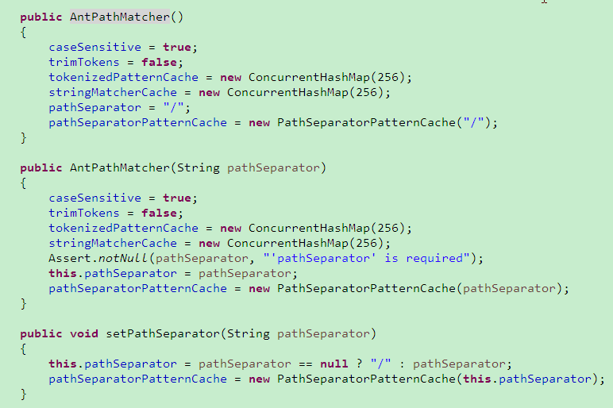

# Ant路径匹配规则AntPathMatcher的注意事项 #

0.AntPathMatcher前言：

（1）SpringMVC的路径匹配规则是依照Ant的来的，实际上不只是SpringMVC，整个Spring框架的路径解析都是按照Ant的风格来的；

（2）AntPathMatcher不仅可以匹配Spring的@RequestMapping路径，也可以用来匹配各种字符串，包括文件路径等。

## 1.基本规则： ##

```
（1）? 匹配一个字符（除过操作系统默认的文件分隔符）
（2）* 匹配0个或多个字符
（3）**匹配0个或多个目录
（4）{spring:[a-z]+} 将正则表达式[a-z]+匹配到的值,赋值给名为 spring 的路径变量.
    (PS:必须是完全匹配才行,在SpringMVC中只有完全匹配才会进入controller层的方法)
```

## 2.注意事项： ##

（1）匹配文件路径，需要匹配某目录下及其各级子目录下所有的文件，使用/**/*而非*.*，因为有的文件不一定含有文件后缀；

（2）匹配文件路径，使用AntPathMatcher创建一个对象时，需要注意AntPathMatcher也有有参构造，传递路径分隔符参数pathSeparator，对于文件路径的匹配来说，则需要根据不同的操作系统来传递各自的文件分隔符，以此防止匹配文件路径错误。源码截图如下：



可以看到，AntPathMatcher默认路径分隔符为“/”，而在匹配文件路径时，需要注意Windows下路径分隔符为“\”，Linux下为“/”，写法即为：

```
    AntPathMatcher matcher = new AntPathMatcher(File.separator)；
    AntPathMatcher matcher = new AntPathMatcher(System.getProperty("file.separator"))；
```

（3）最长匹配规则（has more characters），即越精确的模式越会被优先匹配到。例如，URL请求/app/dir/file.jsp，现在存在两个路径匹配模式/**/*.jsp和/app/dir/*.jsp，那么会根据模式/app/dir/*.jsp来匹配。

## 3.测试用例： ##

```
    // test exact matching
    assertTrue(pathMatcher.match("test", "test"));
    assertTrue(pathMatcher.match("/test", "/test"));
    assertTrue(pathMatcher.match("http://example.org", "http://example.org")); // SPR-14141
    assertFalse(pathMatcher.match("/test.jpg", "test.jpg"));
    assertFalse(pathMatcher.match("test", "/test"));
    assertFalse(pathMatcher.match("/test", "test"));
 
    // test matching with ?'s
    assertTrue(pathMatcher.match("t?st", "test"));
    assertTrue(pathMatcher.match("??st", "test"));
    assertTrue(pathMatcher.match("tes?", "test"));
    assertTrue(pathMatcher.match("te??", "test"));
    assertTrue(pathMatcher.match("?es?", "test"));
    assertFalse(pathMatcher.match("tes?", "tes"));
    assertFalse(pathMatcher.match("tes?", "testt"));
    assertFalse(pathMatcher.match("tes?", "tsst"));
 
    // test matching with *'s
    assertTrue(pathMatcher.match("*", "test"));
    assertTrue(pathMatcher.match("test*", "test"));
    assertTrue(pathMatcher.match("test*", "testTest"));
    assertTrue(pathMatcher.match("test/*", "test/Test"));
    assertTrue(pathMatcher.match("test/*", "test/t"));
    assertTrue(pathMatcher.match("test/*", "test/"));
    assertTrue(pathMatcher.match("*test*", "AnothertestTest"));
    assertTrue(pathMatcher.match("*test", "Anothertest"));
    assertTrue(pathMatcher.match("*.*", "test."));
    assertTrue(pathMatcher.match("*.*", "test.test"));
    assertTrue(pathMatcher.match("*.*", "test.test.test"));
    assertTrue(pathMatcher.match("test*aaa", "testblaaaa"));
    assertFalse(pathMatcher.match("test*", "tst"));
    assertFalse(pathMatcher.match("test*", "tsttest"));
    assertFalse(pathMatcher.match("test*", "test/"));
    assertFalse(pathMatcher.match("test*", "test/t"));
    assertFalse(pathMatcher.match("test/*", "test"));
    assertFalse(pathMatcher.match("*test*", "tsttst"));
    assertFalse(pathMatcher.match("*test", "tsttst"));
    assertFalse(pathMatcher.match("*.*", "tsttst"));
    assertFalse(pathMatcher.match("test*aaa", "test"));
    assertFalse(pathMatcher.match("test*aaa", "testblaaab"));
 
    // test matching with ?'s and /'s
    assertTrue(pathMatcher.match("/?", "/a"));
    assertTrue(pathMatcher.match("/?/a", "/a/a"));
    assertTrue(pathMatcher.match("/a/?", "/a/b"));
    assertTrue(pathMatcher.match("/??/a", "/aa/a"));
    assertTrue(pathMatcher.match("/a/??", "/a/bb"));
    assertTrue(pathMatcher.match("/?", "/a"));
 
    // test matching with **'s
    assertTrue(pathMatcher.match("/**", "/testing/testing"));
    assertTrue(pathMatcher.match("/*/**", "/testing/testing"));
    assertTrue(pathMatcher.match("/**/*", "/testing/testing"));
    assertTrue(pathMatcher.match("/bla/**/bla", "/bla/testing/testing/bla"));
    assertTrue(pathMatcher.match("/bla/**/bla", "/bla/testing/testing/bla/bla"));
    assertTrue(pathMatcher.match("/**/test", "/bla/bla/test"));
    assertTrue(pathMatcher.match("/bla/**/**/bla", "/bla/bla/bla/bla/bla/bla"));
    assertTrue(pathMatcher.match("/bla*bla/test", "/blaXXXbla/test"));
    assertTrue(pathMatcher.match("/*bla/test", "/XXXbla/test"));
    assertFalse(pathMatcher.match("/bla*bla/test", "/blaXXXbl/test"));
    assertFalse(pathMatcher.match("/*bla/test", "XXXblab/test"));
    assertFalse(pathMatcher.match("/*bla/test", "XXXbl/test"));
 
    assertFalse(pathMatcher.match("/????", "/bala/bla"));
    assertFalse(pathMatcher.match("/**/*bla", "/bla/bla/bla/bbb"));
 
    assertTrue(pathMatcher.match("/*bla*/**/bla/**", "/XXXblaXXXX/testing/testing/bla/testing/testing/"));
    assertTrue(pathMatcher.match("/*bla*/**/bla/*", "/XXXblaXXXX/testing/testing/bla/testing"));
    assertTrue(pathMatcher.match("/*bla*/**/bla/**", "/XXXblaXXXX/testing/testing/bla/testing/testing"));
    assertTrue(pathMatcher.match("/*bla*/**/bla/**", "/XXXblaXXXX/testing/testing/bla/testing/testing.jpg"));
 
    assertTrue(pathMatcher.match("*bla*/**/bla/**", "XXXblaXXXX/testing/testing/bla/testing/testing/"));
    assertTrue(pathMatcher.match("*bla*/**/bla/*", "XXXblaXXXX/testing/testing/bla/testing"));
    assertTrue(pathMatcher.match("*bla*/**/bla/**", "XXXblaXXXX/testing/testing/bla/testing/testing"));
    assertFalse(pathMatcher.match("*bla*/**/bla/*", "XXXblaXXXX/testing/testing/bla/testing/testing"));
 
    assertFalse(pathMatcher.match("/x/x/**/bla", "/x/x/x/"));
 
    assertTrue(pathMatcher.match("/foo/bar/**", "/foo/bar")) ;
 
    assertTrue(pathMatcher.match("", ""));
 
    assertTrue(pathMatcher.match("/{bla}.*", "/testing.html"));
```

————————————————

版权声明：本文为CSDN博主「DayDayUp丶」的原创文章，遵循CC 4.0 BY-SA版权协议，转载请附上原文出处链接及本声明。

原文链接：https://blog.csdn.net/songzehao/article/details/80686663