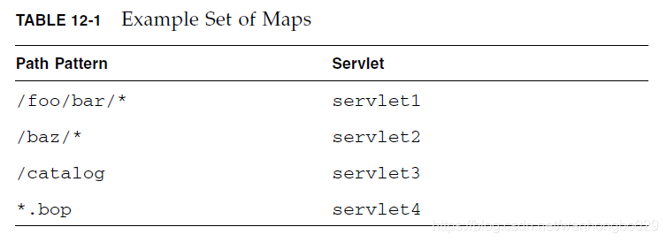

# Servlet配置中servlet-mapping的配置问题 #

Java Servlet Specification 3.1

https://jcp.org/aboutJava/communityprocess/final/jsr340/index.html

专门使用一章的内容讲请求和Servlet之间的映射，下面将翻译该章的内容。

将请求映射到对应的Servlet

本章主要描述web容器怎样将客户端请求映射到对应的Servlet上。

## 12.1关于URL路径 ##

web容器接收到客户端请求后，首选要确定使用容器内的那个web应用来处理该请求，比如http://host:port/xxx/user/add.jsp?id=1，其中/xxx/user/add.jsp为请求URL，/xxx为context path，用来匹配使用那个web应用处理该请求，如果各个web应用都无法匹配该路径，则使用根应用(ROOT)来处理，tomcat中的根应用可以直接放到目录下的webapps目录下的ROOT文件夹内，或者在<Host>元素中配置，主要正确的配置方式是path=""空字符串。

	<Context path="" docBase="F:/Workspaces/MyEclipse2014/test/WebRoot" reloadable="false" crossContext="false"/>

确定使用哪个web应用处理请求后，根据具体web应用的配置（主要是Servlet配置的<url-pattern>），确定使用哪一个Servlet来处理请求，在请求URL中去掉context path和请求参数后，按照顺序，根据如下规则进行匹配，使用第一个匹配成功的规则进行处理。

1.完整路径匹配；

2.根据路径前缀，进行最长匹配，使用'/'作为路径分隔符；

3.使用请求路径中的后缀进行匹配，比如'.jsp'；

4.如果以上都没有匹配到合适的Servlet，将使用默认(default)Servlet来处理请求；

注意：路径匹配过程中，区分大小写；

## 12.2如何配置Servlet中的<url-pattern> ##

使用‘/’开头，使用‘/*’结尾，表示使用路径匹配，比如/foo/bar/*

使用'*.xxx'表示使用后缀匹配；

只使用‘/*’，表示匹配所有的请求；

只使用'/'，表示是一个默认的Servlet；

除此之外，其他的字符都是准确匹配；

## 12.3例子 ##



【注意】/catalog是准确匹配

匹配结果：


Spring MVC的DispatcherServlet的配置

```
<!-- 配置spring mvc -->
<servlet>
    <servlet-name>springMvc</servlet-name>
    <servlet-class>org.springframework.web.servlet.DispatcherServlet</servlet-class>
    <init-param>
        <param-name>contextConfigLocation</param-name>
        <param-value>classpath:spring-mvc.xml</param-value>
    </init-param>
    <load-on-startup>1</load-on-startup>
</servlet>
```

映射方式，采用如下两种方式：

```
<!-- 配置spring mvc mapping -->
<servlet-mapping>
    <servlet-name>springMvc</servlet-name>
    <url-pattern>/</url-pattern>
</servlet-mapping>
```

或者采用后缀映射

```
<!-- 配置spring mvc mapping -->
<servlet-mapping>
    <servlet-name>springMvc</servlet-name>
    <url-pattern>*.do</url-pattern>
</servlet-mapping>
```

【注意】一定不能写为<url-pattern>/*</url-pattern>，这样的话，所有的请求将全部由Spring的DispatcherServlet来处理，显然是不合适的，jsp文件还是应该由Tomcat配置的JSP Servlet来处理。

Tomcat，在conf/web.xml中配置了一个default Servlet，一个jsp Servlet

```
<servlet>
	<servlet-name>default</servlet-name>
	<servlet-class>org.apache.catalina.servlets.DefaultServlet</servlet-class>
	<init-param>
		<param-name>debug</param-name>
		<param-value>0</param-value>
	</init-param>
	<init-param>
		<param-name>listings</param-name>
		<param-value>false</param-value>
	</init-param>
	<load-on-startup>1</load-on-startup>
</servlet>
<servlet>
	<servlet-name>jsp</servlet-name>
	<servlet-class>org.apache.jasper.servlet.JspServlet</servlet-class>
	<init-param>
		<param-name>fork</param-name>
		<param-value>false</param-value>
	</init-param>
	<init-param>
		<param-name>xpoweredBy</param-name>
		<param-value>false</param-value>
	</init-param>
	<load-on-startup>3</load-on-startup>
</servlet>
 
<!-- The mapping for the default servlet -->
<servlet-mapping>
	<servlet-name>default</servlet-name>
	<url-pattern>/</url-pattern>
</servlet-mapping>
 
<!-- The mappings for the JSP servlet -->
<servlet-mapping>
	<servlet-name>jsp</servlet-name>
	<url-pattern>*.jsp</url-pattern>
	<url-pattern>*.jspx</url-pattern>
</servlet-mapping>
```

使用Spring的DispatcherServlet作为默认Servlet后，如果静态资源还需要由Tomcat配置的default Servlet来配置，可以参考Spring中静态资源的配置方式，个人比较倾向于使用如下配置，这样对静态资源的请求就不需要DispatcherServlet来处理了。

```
<!-- 使用Tomcat默认Servlet处理静态资源,该配置仅适用Tomcat容器 -->
<servlet-mapping>
	<servlet-name>default</servlet-name>
	<url-pattern>*.css</url-pattern>
	<url-pattern>*.jpg</url-pattern>
	<url-pattern>*.gif</url-pattern>
	<url-pattern>*.js</url-pattern>
</servlet-mapping>
```

————————————————

版权声明：本文为CSDN博主「wanhongbo029」的原创文章，遵循CC 4.0 BY-SA版权协议，转载请附上原文出处链接及本声明。

原文链接：https://blog.csdn.net/wanhongbo029/article/details/85612152