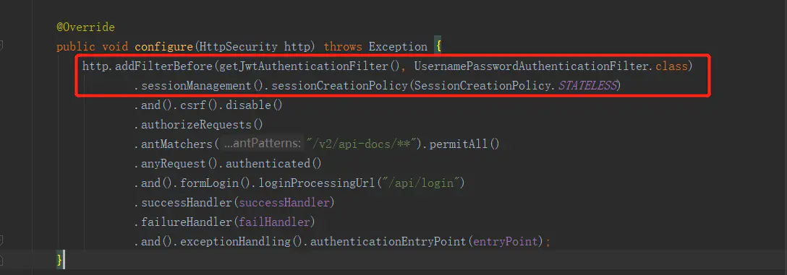

# Spring Boot+Spring security+Jwt实现token控制权限 #

主要实现的功能是Login拿到token，再用token请求资源。关于登录用户名密码验证这个在另一篇文章有提到（Spring Boot + Security实现简单验证登录操作），这里就主要讲token的生成，验证以及用户具体权限的验证。

[GitHub代码地址](https://github.com/SayoJi/authentication-login)

本例子功能如下图：


## 1.引入Spring Security Jwt依赖。 ##

```
        <!--spring security -->
        <dependency>
            <groupId>org.springframework.security.oauth</groupId>
            <artifactId>spring-security-oauth2</artifactId>
        </dependency>
        <dependency>
            <groupId>org.springframework.security</groupId>
            <artifactId>spring-security-jwt</artifactId>
        </dependency>
        <dependency>
            <groupId>io.jsonwebtoken</groupId>
            <artifactId>jjwt</artifactId>
            <version>0.9.0</version>
        </dependency>
```

## 2.创建JwtTokenProvider类提供生成以及验证token的方法。 ##

生成token主要用到四个元素：

1）username token主要的标志

2）expireTime token过期时间（xxx ms）

3）issuedDate token的创建时间

4）signWith token签名，包括签名方法和密钥

这里的过期时间和密钥配在properties文件里面，代码通过@Value拿的。

```
jwtTokenSecret = Sayo
tokenExpiredMs = 604800000
```

```
@Component
@PropertySource("classpath:auth.properties")
public class AuthParameters {

    private String jwtTokenSecret;
    private long tokenExpiredMs;

    public String getJwtTokenSecret() {
        return jwtTokenSecret;
    }

    @Value("${jwtTokenSecret}")
    public void setJwtTokenSecret(String jwtTokenSecret) {
        this.jwtTokenSecret = jwtTokenSecret;
    }

    public long getTokenExpiredMs() {
        return tokenExpiredMs;
    }

    @Value("${tokenExpiredMs}")
    public void setTokenExpiredMs(long tokenExpiredMs) {
        this.tokenExpiredMs = tokenExpiredMs;
    }
}
```

**验证token用同样的密钥去解开token**

倘若能解开则表示该token是合法可用的，解析时有可能会抛出以下5个exception，可以分别catch处理log出日志，这里都统一处理了。

1）ExpiredJwtException token时效过期异常

2）UnsupportedJwtException 验证的token和期待的token格式不一样时，例如解析的是一个明文JWT而期待的是一个加密签名JWT时就会抛出这个异常。

3）MalformedJwtException 表示这不是一个正确方法创建的token。

4）SignatureException token签名验证失败异常

5）IllegalArgumentException token为null或者空异常

```
@Component

public class JwtTokenProvider {

    Loggerlogger = LoggerFactory.getLogger(JwtTokenProvider.class);

    @Autowired

    private AuthParametersauthParameters;

    /**

     * Generate token for user login.

     *

     * @param authentication

     * @return return a token string.

     */

     public String createJwtToken(Authentication authentication) {

        //user name

        String username = ((org.springframework.security.core.userdetails.User) authentication.getPrincipal()).getUsername();

        //expire time

        Date expireTime =new Date(System.currentTimeMillis()+authParameters.getTokenExpiredMs());

        //create token

        String token = Jwts.builder()

                      .setSubject(username)

                      .setExpiration(expireTime)

                      .setIssuedAt(new Date())

                      .signWith(SignatureAlgorithm.HS512, authParameters.getJwtTokenSecret())

                      .compact();

         return token;

    }

    /**

     * validate token eligible.

     * if Jwts can parse the token string and no throw any exception, then the token is eligible.

     * @param token a jws string.

*/

    public boolean validateToken(String token) {

        String VALIDATE_FAILED ="validate failed : ";

        try {
              Jwts.parser()
                  .setSigningKey(authParameters.getJwtTokenSecret())
                  .parseClaimsJws(token);

              return true;

        }catch (Exception ex) {

              //ExpiredJwtException, UnsupportedJwtException, MalformedJwtException, SignatureException, //IllegalArgumentException

              logger.error(VALIDATE_FAILED + ex.getMessage());

              return false;

        }

}

}
```


image

## 3.创建JwtAuthenticationFilter类在用户获取资源之前让spring去filter这个token是否合法可用。 ##

继承OncePerRequestFilter重写doFilterInternal方法，前端发送请求时，token会放在header，在每个请求读取资源之前后台对token进行filter。

```
public class JwtAuthenticationFilter extends OncePerRequestFilter {

    private Logger logger = LoggerFactory.getLogger(JwtAuthenticationFilter.class);

    @Autowired
    private JwtTokenProvider jwtTokenProvider;

    @Autowired
    private AuthParameters authParameters;

    @Autowired
    private UserService userService;

    //1.从每个请求header获取token
    //2.调用前面写的validateToken方法对token进行合法性验证
    //3.解析得到username，并从database取出用户相关信息权限
    //4.把用户信息(role等)以UserDetail形式放进SecurityContext以备整个请求过程使用。
    // （例如哪里需要判断用户权限是否足够时可以直接从SecurityContext取出去check）
    @Override
    protected void doFilterInternal(HttpServletRequest request, HttpServletResponse response, FilterChain filterChain)
            throws ServletException, IOException {
        String token = getJwtFromRequest(request);

        if (token != null && jwtTokenProvider.validateToken(token)) {
            String username = getUsernameFromJwt(token, authParameters.getJwtTokenSecret());

            UserDetails userDetails = userService.getUserDetailByUserName(username);

            Authentication authentication = new UsernamePasswordAuthenticationToken(
                    userDetails,null,userDetails.getAuthorities());
            SecurityContextHolder.getContext().setAuthentication(authentication);

        } else {
            logger.error(request.getParameter("username") + " :Token is null");
        }
        super.doFilter(request, response, filterChain);
    }

    /**
     * Get Bear jwt from request header Authorization.
     *
     * @param request servlet request.
     * @return token or null.
     */
    private String getJwtFromRequest(HttpServletRequest request) {
        String token = request.getHeader("Authorization");
        if (token != null && token.startsWith("Bearer")) {
            return token.replace("Bearer ", "");
        }
        return null;
    }

    /**
     * Get user name from Jwt, the user name have set to jwt when generate token.
     *
     * @param token jwt token.
     * @param signKey jwt sign key, set in properties file.
     * @return user name.
     */
    private String getUsernameFromJwt(String token, String signKey) {
        return Jwts.parser().setSigningKey(signKey)
                .parseClaimsJws(token)
                .getBody()
                .getSubject();
    }
}
```

上面调用到的getUserDetailByUserName在UserService

```
    /**
     * Get {@link UserDetails} by user name.
     * @return
     */
    @Transactional
    public UserDetails getUserDetailByUserName(String username){

        User user = this.userRepository.findByUserName(username);

        if(user == null){
            //throw exception inform front end not this user
            throw new UsernameNotFoundException("user + " + username + "not found.");
        }

        List<String> roleList = this.userRepository.queryUserOwnedRoleCodes(username);
        List<GrantedAuthority> authorities = roleList.stream()
                .map(role -> new SimpleGrantedAuthority(role)).collect(Collectors.toList());

        return new org.springframework.security.core.userdetails
                .User(username,user.getPassword(),authorities);
    }
```

## 4.配置HttpSecurity ##

其他配置说明在文章开头提到的另一篇文章中有写，这里只说新添加的配置

1）添加注解@EnableGlobalMethodSecurity，并设置prePostEnabled为true（默认是false），启用Spring security的前注解（例如本例用到的@PreAuthorize）

2）把自定义的JwtAuthenticationFilter添加到UsernamePasswordAuthenticationFilter之前。

3）因为我们使用了token，所以session要禁止掉创建和使用，不然会白白耗掉很多空间，SessionCreationPolicy设为STATELESS，即永不创建HttpSession并且不会使用HttpSession去获取SecurityContext。


WebSecurityConfig.java



WebSecurityConfig.java

## 5.登陆成功在AuthenticationSuccessHandler返回token给前端 ##

```
@Service("authenticationSuccessHandler")
public class AuthenticationSuccessHandler extends SavedRequestAwareAuthenticationSuccessHandler {

    @Autowired
    private JwtTokenProvider tokenProvider;

    @Override
    public void onAuthenticationSuccess(HttpServletRequest request, HttpServletResponse response
            , Authentication authentication) throws IOException {
        logger.info("User: " + authentication.getName() + " Login successfully.");
        this.returnJson(response,authentication);
    }

    private void returnJson(HttpServletResponse response,Authentication authentication) throws IOException {
        response.setStatus(HttpServletResponse.SC_OK);
        response.setCharacterEncoding("UTF-8");
        response.setContentType("application/json");
        response.getWriter()
                .println("{\"tokenType\":\"Bearer\",\"token\": \"" + tokenProvider.createJwtToken(authentication) + "\"}");
    }
}
```

## 6.在Controller方法加上具体权限限制 ##

用@PreAuthorize("hasAuthority('role')")，进行方法级别验证登录user的是否有足够的权限访问该方法，这里举例用的是admin权限。

```
@RestController
@RequestMapping("/api")
public class UserController {

    @Autowired
    private UserService userService;

    @GetMapping(value = "/user")
    @PreAuthorize("hasAuthority('admin')")
    public UserView getUserByName(@RequestParam("userName") String userName) {
        return userService.getUserByUserName(userName);
    }
}
```

hasAuthority在spring中的源码，主要是在authentication中拿到当前user所拥有的role然后再check是否包含有访问这个方法需要的role。

```
    public final boolean hasAuthority(String authority) {
        return hasAnyAuthority(authority);
    }

    public final boolean hasAnyAuthority(String... authorities) {
        return hasAnyAuthorityName(null, authorities);
    }
    private boolean hasAnyAuthorityName(String prefix, String... roles) {
        Set<String> roleSet = getAuthoritySet();

        for (String role : roles) {
            String defaultedRole = getRoleWithDefaultPrefix(prefix, role);
            if (roleSet.contains(defaultedRole)) {
                return true;
            }
        }

        return false;
    }
```

## 7. 测试 ##

先看看我数据库的数据是这样的。


user table


role table


user_map_role table

**登陆带admin权限的用户，成功获取资源**

1）登录


login-Sayo

2）请求资源在Header带上key为Authorization，value为Bearer +token，因为当前登录的用户Sayo在数据库是带有admin权限所以成功获得数据。


request

**登录不带admin权限的用户，无法获取资源，返回权限不够提示**

1）登录


login-Ly

2）当前用户不带admin权限，而该方法配置了需要admin权限访问，请求资源失败


request

作者：double_Ji

链接：https://www.jianshu.com/p/0292f4e42c84

来源：简书

著作权归作者所有。商业转载请联系作者获得授权，非商业转载请注明出处。