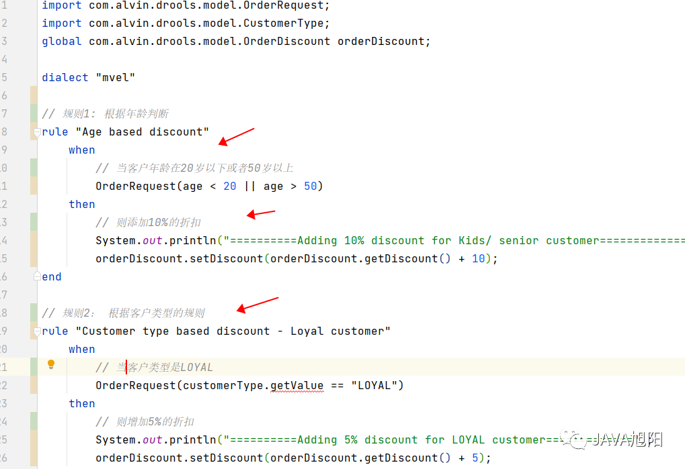
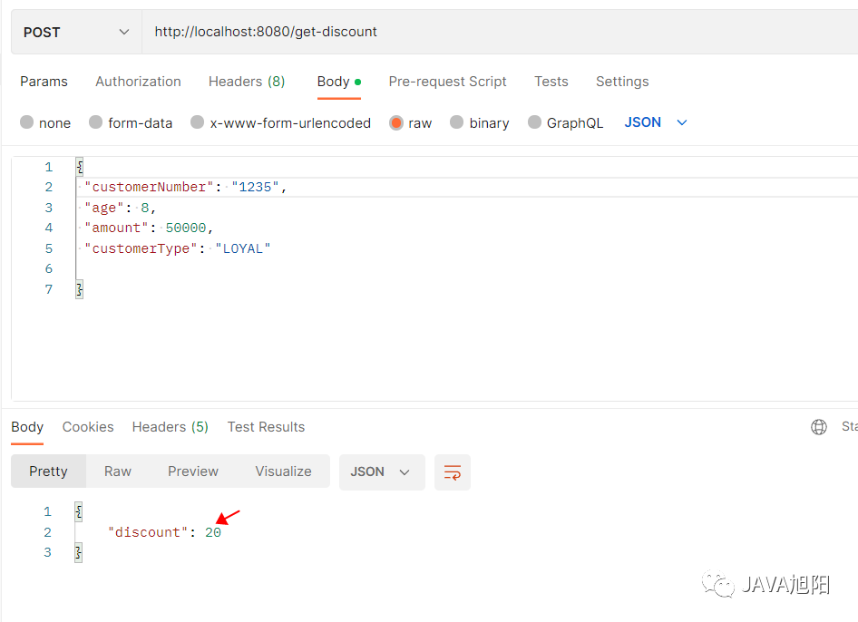
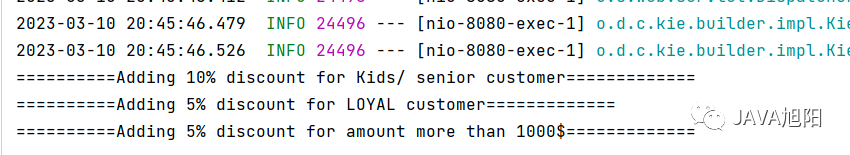

# SpringBoot + 规则引擎 Drools，强！

## 前言

现在有这么个需求，网上购物，需要根据不同的规则计算商品折扣，比如VIP客户增加5%的折扣，购买金额超过1000元的增加10%的折扣等，而且这些规则可能随时发生变化，甚至增加新的规则。面对这个需求，你该怎么实现呢？难道是计算规则一变，就要修改业务代码，重新测试，上线吗。

其实，我们可以通过规则引擎来实现，Drools 就是一个开源的业务规则引擎，可以很容易地与 spring boot 应用程序集成，那本文就用Drools来实现一下上面说的需求吧。

## 引入依赖

我们创建一个spring boot应用程序，pom中添加drools相关的依赖，如下：

```
<dependency>
  <groupId>org.drools</groupId>
  <artifactId>drools-core</artifactId>
  <version>7.59.0.Final</version>
</dependency>
<dependency>
  <groupId>org.drools</groupId>
  <artifactId>drools-compiler</artifactId>
  <version>7.59.0.Final</version>
</dependency>
<dependency>
  <groupId>org.drools</groupId>
  <artifactId>drools-decisiontables</artifactId>
  <version>7.59.0.Final</version>
</dependency>
```

## Drools配置类

创建一个名为`DroolsConfig`的配置 java 类。

```
@Configuration
public class DroolsConfig {
    // 制定规则文件的路径
    private static final String RULES_CUSTOMER_RULES_DRL = "rules/customer-discount.drl";
    private static final KieServices kieServices = KieServices.Factory.get();

    @Bean
    public KieContainer kieContainer() {
        KieFileSystem kieFileSystem = kieServices.newKieFileSystem();
        kieFileSystem.write(ResourceFactory.newClassPathResource(RULES_CUSTOMER_RULES_DRL));
        KieBuilder kb = kieServices.newKieBuilder(kieFileSystem);
        kb.buildAll();
        KieModule kieModule = kb.getKieModule();
        KieContainer kieContainer = kieServices.newKieContainer(kieModule.getReleaseId());
        return kieContainer;
    }
}
```

- 定义了一个 `KieContainer`的`Spring Bean` ，`KieContainer`用于通过加载应用程序的`/resources`文件夹下的规则文件来构建规则引擎。
- 创建`KieFileSystem`实例并配置规则引擎并从应用程序的资源目录加载规则的 `DRL` 文件。
- 使用`KieBuilder`实例来构建 `drools` 模块。我们可以使用KieSerive单例实例来创建 `KieBuilder` 实例。
- 最后，使用 `KieService` 创建一个 `KieContainer` 并将其配置为 `spring bean`。

## 添加业务Model

创建一个订单对象`OrderRequest`，这个类中的字段后续回作为输入信息发送给定义的`drools`规则中，用来计算给定客户订单的折扣金额。

```
@Getter
@Setter
public class OrderRequest {
    /**
     * 客户号
     */
    private String customerNumber;
    /**
     * 年龄
     */
    private Integer age;
    /**
     * 订单金额
     */
    private Integer amount;
    /**
     * 客户类型
     */
    private CustomerType customerType;
}
```

此外，定义一个客户类型`CustomerType` 的枚举，规则引擎会根据该值计算客户订单折扣百分比，如下所示。

```
public enum CustomerType {
    LOYAL, NEW, DISSATISFIED;

    public String getValue() {
        return this.toString();
    }
}
```

最后，创建一个订单折扣类 `OrderDiscount` ，用来表示计算得到的最终的折扣，如下所示。

```
@Getter
@Setter
public class OrderDiscount {

    /**
     * 折扣
     */
    private Integer discount = 0;
}
```

我们将使用上述响应对象返回计算出的折扣。

## 定义drools 规则

前面的`DroolsConfig`类中指定`drools`规则的目录，现在我们在`/src/main/resources/rules`目录下添加`customer-discount.drl`文件，在里面定义对应的规则。



这个`drl`文件虽然不是java文件，但还是很容易看懂的。

- 我们使用了一个名为`orderDiscount` 的全局参数，可以在多个规则之间共享。
- `drl` 文件可以包含一个或多个规则。我们可以使用`mvel`语法来指定规则。此外，每个规则使用`rule`关键字进行描述。
- 每个规则`when-then`语法来定义规则的条件。
- 根据订单请求的输入值，我们正在为结果添加折扣。如果规则表达式匹配，每个规则都会向全局结果变量添加额外的折扣。

**完整的规则源码如下：**

```
import com.alvin.drools.model.OrderRequest;
import com.alvin.drools.model.CustomerType;
global com.alvin.drools.model.OrderDiscount orderDiscount;

dialect "mvel"

// 规则1: 根据年龄判断
rule "Age based discount"
    when
        // 当客户年龄在20岁以下或者50岁以上
        OrderRequest(age < 20 || age > 50)
    then
        // 则添加10%的折扣
        System.out.println("==========Adding 10% discount for Kids/ senior customer=============");
        orderDiscount.setDiscount(orderDiscount.getDiscount() + 10);
end

// 规则2： 根据客户类型的规则
rule "Customer type based discount - Loyal customer"
    when
        // 当客户类型是LOYAL
        OrderRequest(customerType.getValue == "LOYAL")
    then
        // 则增加5%的折扣
        System.out.println("==========Adding 5% discount for LOYAL customer=============");
        orderDiscount.setDiscount(orderDiscount.getDiscount() + 5);
end

rule "Customer type based discount - others"
    when
    OrderRequest(customerType.getValue != "LOYAL")
then
    System.out.println("==========Adding 3% discount for NEW or DISSATISFIED customer=============");
    orderDiscount.setDiscount(orderDiscount.getDiscount() + 3);
end

rule "Amount based discount"
    when
        OrderRequest(amount > 1000L)
    then
        System.out.println("==========Adding 5% discount for amount more than 1000$=============");
    orderDiscount.setDiscount(orderDiscount.getDiscount() + 5);
end
```

## 添加Service层

创建一个名为`OrderDiscountService` 的服务类，如下：。

```
@Service
public class OrderDiscountService {

    @Autowired
    private KieContainer kieContainer;

    public OrderDiscount getDiscount(OrderRequest orderRequest) {
        OrderDiscount orderDiscount = new OrderDiscount();
        // 开启会话
        KieSession kieSession = kieContainer.newKieSession();
        // 设置折扣对象
        kieSession.setGlobal("orderDiscount", orderDiscount);
        // 设置订单对象
        kieSession.insert(orderRequest);
        // 触发规则
        kieSession.fireAllRules();
        // 中止会话
        kieSession.dispose();
        return orderDiscount;
    }
}
```

- 注入`KieContainer`实例并创建一个`KieSession`实例。
- 设置了一个`OrderDiscount`类型的全局参数，它将保存规则执行结果。
- 使用`insert()`方法将请求对象传递给 `drl` 文件。
- 调用`fireAllRules()`方法触发所有规则。
- 最后通过调用`KieSession` 的`dispose()`方法终止会话。

## 添加Controller

创建一个名为`OrderDiscountController` 的`Controller`类，具体代码如下：

```
@RestController
public class OrderDiscountController {

    @Autowired
    private OrderDiscountService orderDiscountService;

    @PostMapping("/get-discount")
    public ResponseEntity<OrderDiscount> getDiscount(@RequestBody OrderRequest orderRequest) {
        OrderDiscount discount = orderDiscountService.getDiscount(orderRequest);
        return new ResponseEntity<>(discount, HttpStatus.OK);
    }
}
```

## 测试一下

运行 `spring boot` 应用程序并通过发送客户订单请求 JSON 来访问 REST API 端点。

- 对于年龄 < 20 且金额 > 1000 的 `LOYAL` 客户类型，我们应该根据我们定义的规则获得 `20%` 的折扣。





## 总结

我们通过`drools`规则引擎简单实现了这样一个折扣的业务，现在产品经理说要你加一条规则，比如地址是杭州的折扣加10%，你就直接改这个drl文件，其他时间用来摸鱼就好了，哈哈~~。更多关于`drools`的用法大家可以去官网探索。

## 推荐阅读

- [面试官：断网了，还能 ping 通 127.0.0.1 吗？](https://mp.weixin.qq.com/s?__biz=MzU1Nzg4NjgyMw==&mid=2247507751&idx=1&sn=f5b8fdaf982a88c5cd8a63682f76d199&scene=21#wechat_redirect)
- [技术总监：谁再不按规范写代码，以后就不用来了！](https://mp.weixin.qq.com/s?__biz=MzU1Nzg4NjgyMw==&mid=2247507689&idx=1&sn=69b1092887dfe0ad3dac3bcd8fe4f916&scene=21#wechat_redirect)
- [公司新入职一位大佬，把SpringBoot项目启动时间从7分钟降到了40秒！](https://mp.weixin.qq.com/s?__biz=MzU1Nzg4NjgyMw==&mid=2247507653&idx=1&sn=c189f73f8ce13b766ff93433152639dd&scene=21#wechat_redirect)
- [和 if else说再见，SpringBoot 这样做参数校验才足够优雅！](https://mp.weixin.qq.com/s?__biz=MzU1Nzg4NjgyMw==&mid=2247507619&idx=1&sn=81e07e245e5c0c1e3e1af711148fef2b&scene=21#wechat_redirect)
- [用一个月重构了同事写的烂代码，我总结了8条重写烂代码的经验！](https://mp.weixin.qq.com/s?__biz=MzU1Nzg4NjgyMw==&mid=2247507579&idx=1&sn=edd93c9f527c880385b459fed51c9ab4&scene=21#wechat_redirect)
- [告警：线上慎用 ThreadLocal，坑的差点被开了！](https://mp.weixin.qq.com/s?__biz=MzU1Nzg4NjgyMw==&mid=2247507558&idx=1&sn=e35a0d35d2dfe3c575be0299a85cede8&scene=21#wechat_redirect)
- [重磅更新！Mall实战教程全面升级，瞬间高大上了！](https://mp.weixin.qq.com/s?__biz=MzU1Nzg4NjgyMw==&mid=2247499376&idx=1&sn=3ed28795cdd35fbaa3506e74a56703b0&scene=21#wechat_redirect)
- [40K+Star！Mall电商实战项目开源回忆录！](https://mp.weixin.qq.com/s?__biz=MzU1Nzg4NjgyMw==&mid=2247486684&idx=1&sn=807fd808adac8019eb2095ba088efe54&scene=21#wechat_redirect)