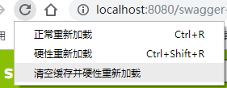

# SpringBoot使用Swagger2出现Unable to infer base url. #

在使用SpringBoot中配置Swagger2的时候，出现

Unable to infer base url. This is common when using dynamic servlet registration or when the API is behind an API Gateway. The base url is the root of where all the swagger resources are served. For e.g. if the api is available at http://example.org/api/v2/api-docs then the base url is http://example.org/api/. Please enter the location manually:

## 可能由以下几个原因造成： ##

- 需要在SpringBoot的启动Application前面加上 @EnableSwagger2注解；
- 可能是由于使用了Spring Security 影响：尝试使用以下Spring Security配置解决：

```
import org.springframework.context.annotation.Configuration;
import org.springframework.security.config.annotation.web.builders.HttpSecurity;
import org.springframework.security.config.annotation.web.configuration.WebSecurityConfigurerAdapter;
 
@Configuration
class SecurityConfig extends WebSecurityConfigurerAdapter {
 
    private static final String[] AUTH_WHITELIST = {
 
            // -- swagger ui
            "/swagger-resources/**",
            "/swagger-ui.html",
            "/v2/api-docs",
            "/webjars/**"
    };
    
    @Override
    protected void configure(HttpSecurity http) throws Exception {
        http.authorizeRequests()
                .antMatchers(AUTH_WHITELIST).permitAll()
                .antMatchers("/**/*").denyAll();
    }
}
```

引用来自 https://github.com/springfox/springfox/issues/1996#issuecomment-335155187

3. 配置在修改后再次刷新需要清空浏览器缓存，否则配置可能无法生效。如果使用chrome内核的浏览器，可以长按刷新键清空缓存访问，如图所示



4.但是在我的项目中，发现是我使用Spring的ResponseBodyAdvice全局返回再处理的一个类，本意是为所有返回JSON数据统一添加“状态=succuess”等信息，没想到该实现影响了Swagger的使用，会导致swagger返回的JSON数据格式和期望的不一致，故swagger报错。解决方法在该接口实现类上面的@ControllerAdvice 注解限制接口的扫描包即可避免。

	@ControllerAdvice(basePackages = "com.zhaoxuyang.controller")
 

5.在排查该问题时，假设你的swagger-ui访问路径是http://localhost:8080/swagger-ui.html，可以先直接访问 http://localhost:8080/v2/api-docs，查看swagger是否正确获取到了JSON格式的数据，且JSON格式数据是否为类似以下格式，如果不对则可能是因为别的返回预处理接口对数据进行了处理，导致swagger无法获取到正确的数据。

```
{
	"swagger": "2.0",
	"info": {
		"description": "My project for swagger practice",
		"version": "v1.1",
		"title": "swagger-demo",
		"license": {
			"url": "http://www.apache.org/licenses/LICENSE-2.0"
		}
	},
	"host": "http://localhost:8080",
	"basePath": "/"
}
```

本文固定链接 :https://zhaoxuyang.com/springboot%E4%BD%BF%E7%94%A8swagger2%E5%87%BA%E7%8E%B0unable-to-infer-base-url-this-is-common-when-using-dynamic-servlet-registration-or-when-the-api-is-behind-an-api-gateway/

转载请注明出处: 青枫浦上 ,  Seayon阿阳


业余草

2018年8月21日 下午3:37

多谢，测试了，加上注解就可以了


马甲

2020年5月29日 下午2:45

感谢大佬


洪小才

2019年9月14日 下午6:32

困了我一个下午的难题解决了，大佬，请收下我的膝盖，谢谢


小Z

2020年6月29日 下午5:21

感谢大佬提醒json格式问题，因为工程中有filter对返回请求做了包装，导致swagger无法正常解析。