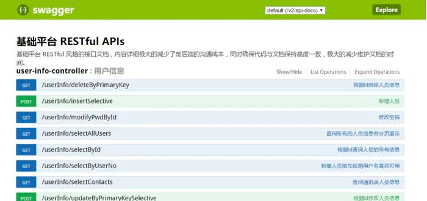
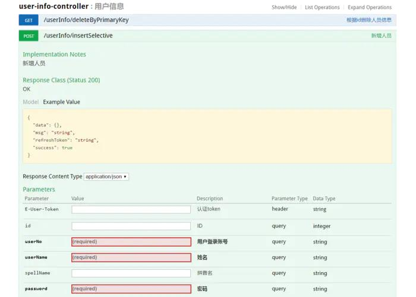

# SpringMVC集成Swagger插件以及Swagger注解的简单使用 #

## 一、简介 ##

Swagger 是一个规范和完整的框架，用于生成、描述、调用和可视化 RESTful 风格的 Web 服务。总体目标是使客户端和文件系统作为服务器以同样的速度来更新 。接口的方法，参数和模型紧密集成到服务器端的代码，允许API来始终保持同步。Swagger 让部署管理和使用功能强大的API从未如此简单。
我们的RESTful API就有可能要面对多个开发人员或多个开发团队：IOS开发、Android开发、Web开发等。为了减少与其他团队平时开发期间的频繁沟通成本，传统做法我们会创建一份RESTful API文档来记录所有接口细节，然而这样的做法有以下几个问题：


- 由于接口众多，并且细节复杂（需要考虑不同的HTTP请求类型、HTTP头部信息、HTTP请求内容等），高质量地创建这份文档本身就是件非常吃力的事，下游的抱怨声不绝于耳；
- 随着时间推移，不断修改接口实现的时候都必须同步修改接口文档，而文档与代码又处于两个不同的媒介，除非有严格的管理机制，不然很容易导致不一致现象；


而swagger完美的解决了上面的几个问题，并与Spring MVC程序配合组织出强大RESTful API文档。它既可以减少我们创建文档的工作量，同时说明内容又整合入实现代码中，让维护文档和修改代码整合为一体，可以让我们在修改代码逻辑的同时方便的修改文档说明。另外Swagger2也提供了强大的页面测试功能 来调试每个RESTful API。

## 二、添加Swagger2依赖 ##

```
<dependency>
     <groupId>io.springfox</groupId>
     <artifactId>springfox-swagger2</artifactId>
     <version>2.6.1</version>
</dependency>
<dependency>
     <groupId>io.springfox</groupId>
     <artifactId>springfox-swagger-ui</artifactId>
     <version>2.6.1</version>
</dependency>
<dependency>  
     <groupId>com.fasterxml.jackson.core</groupId>  
     <artifactId>jackson-core</artifactId>  
     <version>2.6.5</version>  
</dependency>  
<dependency>  
     <groupId>com.fasterxml.jackson.core</groupId>  
     <artifactId>jackson-databind</artifactId>  
     <version>2.6.5</version>  
</dependency>  
<dependency>  
     <groupId>com.fasterxml.jackson.core</groupId>  
     <artifactId>jackson-annotations</artifactId>  
     <version>2.6.5</version>  
</dependency>
```

## 三、创建Swagger2配置类 ##

```
package com.xia.common.config;
import org.springframework.context.annotation.Bean;
import org.springframework.context.annotation.Configuration;
import org.springframework.web.servlet.config.annotation.EnableWebMvc;
import io.swagger.annotations.ApiOperation;
import springfox.documentation.builders.ApiInfoBuilder;
import springfox.documentation.builders.PathSelectors;
import springfox.documentation.builders.RequestHandlerSelectors;
import springfox.documentation.service.ApiInfo;
import springfox.documentation.spi.DocumentationType;
import springfox.documentation.spring.web.plugins.Docket;
import springfox.documentation.swagger2.annotations.EnableSwagger2;

/**
 * 类描述：配置swagger2信息 
 * 创建人：XiaChengwei 
 * 创建时间：2017年7月28日 上午10:03:29
 * @version 1.0
 */
@Configuration      //让Spring来加载该类配置
@EnableWebMvc       //启用Mvc，非springboot框架需要引入注解@EnableWebMvc
@EnableSwagger2     //启用Swagger2
public class Swagger2Config {
    @Bean
    public Docket createRestApi() {
        return new Docket(DocumentationType.SWAGGER_2)
                .apiInfo(apiInfo()).select()
                //扫描指定包中的swagger注解
                //.apis(RequestHandlerSelectors.basePackage("com.xia.controller"))
                //扫描所有有注解的api，用这种方式更灵活
                .apis(RequestHandlerSelectors.withMethodAnnotation(ApiOperation.class))
                .paths(PathSelectors.any())
                .build();
    }

    private ApiInfo apiInfo() {
        return new ApiInfoBuilder()
                .title("基础平台 RESTful APIs")
                .description("基础平台 RESTful 风格的接口文档，内容详细，极大的减少了前后端的沟通成本，同时确保代码与文档保持高度一致，极大的减少维护文档的时间。")
                .termsOfServiceUrl("http://xiachengwei5.coding.me")
                .contact("Xia")
                .version("1.0.0")
                .build();
    }
}
```

## 四、编写swagger注解 ##

实体类：

```
package com.xia.model;

import java.util.Date;
import org.springframework.format.annotation.DateTimeFormat;
import com.fasterxml.jackson.annotation.JsonFormat;
import com.fasterxml.jackson.annotation.JsonIgnoreProperties;
import com.fasterxml.jackson.annotation.JsonInclude;
import io.swagger.annotations.ApiModel;
import io.swagger.annotations.ApiModelProperty;
/**
 * 人员信息表
 * 注解：@ApiModel 和 @ApiModelProperty 用于在通过对象接收参数时在API文档中显示字段的说明
 * 注解：@DateTimeFormat 和 @JsonFormat 用于在接收和返回日期格式时将其格式化
 * 实体类对应的数据表为：  user_info
 * @author XiaChengwei 
 * @date:  2017-07-14 16:45:29
 */
@JsonInclude(JsonInclude.Include.NON_NULL)
@JsonIgnoreProperties({ "handler","hibernateLazyInitializer" }) 
@ApiModel(value ="UserInfo")
public class UserInfo {
    @ApiModelProperty(value = "ID")
    private Integer id;

    @ApiModelProperty(value = "用户登录账号", required = true)
    private String userNo;

    @ApiModelProperty(value = "姓名", required = true)
    private String userName;
    
    @ApiModelProperty(value = "姓名拼音")
    private String spellName;

    @ApiModelProperty(value = "密码", required = true)
    private String password;

    @ApiModelProperty(value = "手机号", required = true)
    private String userPhone;

    @ApiModelProperty(value = "性别")
    private Integer userGender;

    @ApiModelProperty(value = "记录创建时间")
    @DateTimeFormat(pattern = "yyyy-MM-dd HH:mm:ss")
    private Date createTime;

    @ApiModelProperty(value = "记录修改时间")
    @DateTimeFormat(pattern = "yyyy-MM-dd HH:mm:ss")
    private Date updateTime;
    
    public Integer getId() {
        return id;
    }

    public void setId(Integer id) {
        this.id = id;
    }
    
    public String getUserNo() {
        return userNo;
    }

    public void setUserNo(String userNo) {
        this.userNo = userNo == null ? null : userNo.trim();
    }
    
    public String getUserName() {
        return userName;
    }

    public void setUserName(String userName) {
        this.userName = userName == null ? null : userName.trim();
    }
    
    public String getSpellName() {
        return spellName;
    }

    public void setSpellName(String spellName) {
        this.spellName = spellName;
    }

    public String getPassword() {
        return password;
    }

    public void setPassword(String password) {
        this.password = password == null ? null : password.trim();
    }
   
    public String getUserPhone() {
        return userPhone;
    }

    public void setUserPhone(String userPhone) {
        this.userPhone = userPhone == null ? null : userPhone.trim();
    }
    
    public Integer getUserGender() {
        return userGender;
    }

    public void setUserGender(Integer userGender) {
        this.userGender = userGender;
    }
  
    @JsonFormat(locale = "zh", timezone = "GMT+8", pattern = "yyyy-MM-dd HH:mm:ss")
    public Date getCreateTime() {
        return createTime;
    }

    public void setCreateTime(Date createTime) {
        this.createTime = createTime;
    }

    @JsonFormat(locale = "zh", timezone = "GMT+8", pattern = "yyyy-MM-dd HH:mm:ss")
    public Date getUpdateTime() {
        return updateTime;
    }

    public void setUpdateTime(Date updateTime) {
        this.updateTime = updateTime;
    }

    @Override
    public String toString() {
        StringBuilder sb = new StringBuilder();
        sb.append(getClass().getSimpleName());
        sb.append(" [");
        sb.append("Hash = ").append(hashCode());
        sb.append(", id=").append(id);
        sb.append(", userNo=").append(userNo);
        sb.append(", userName=").append(userName);
        sb.append(", spellName=").append(spellName);
        sb.append(", password=").append(password);
        sb.append(", userPhone=").append(userPhone);
        sb.append(", userGender=").append(userGender);
        sb.append(", createTime=").append(createTime);
        sb.append(", updateTime=").append(updateTime);
        sb.append("]");
        return sb.toString();
    }
}
```

控制类：

```
package com.infore.controller;

import org.springframework.web.bind.annotation.RequestMapping;
import org.springframework.web.bind.annotation.RequestMethod;
import org.springframework.web.bind.annotation.ResponseBody;
import org.springframework.web.bind.annotation.RestController;
import com.github.pagehelper.PageHelper;
import com.github.pagehelper.PageInfo;
import com.infore.common.pinyin.PinyinUtils;
import com.infore.common.util.ControllerUtil;
import com.infore.model.ResponseDto;
import com.infore.model.UserInfo;
import com.infore.model.dto.UserInfoDto;
import com.infore.service.UserInfoService;
import gbap.log.Logger;
import gbap.log.LoggerFactory;
import io.swagger.annotations.Api;
import io.swagger.annotations.ApiImplicitParam;
import io.swagger.annotations.ApiImplicitParams;
import io.swagger.annotations.ApiOperation;
import java.util.List;
import javax.annotation.Resource;
import javax.ws.rs.core.MediaType;

/**
 * 人员信息控制类
 * @author XiaChengwei 
 * @date:  2017-07-14 16:45:29
 */
@RestController
@RequestMapping(value = "/userInfo", produces = MediaType.APPLICATION_JSON)
@Api(value = "用户信息", description = "用户信息", produces = MediaType.APPLICATION_JSON)
public class UserInfoController {
    private Logger logger = LoggerFactory.getLogger(getClass());
    
    @Resource
    UserInfoService service;
    
    @ResponseBody
    @RequestMapping(value = "/selectAllUsers", method = RequestMethod.GET)
    @ApiOperation(value = "查询所有的人员信息并分页展示", notes = "查询所有的人员信息并分页展示")
    @ApiImplicitParams({
        @ApiImplicitParam(name = "page",value = "跳转到的页数", required = true, paramType = "query"),
        @ApiImplicitParam(name = "size",value = "每页展示的记录数", required = true, paramType = "query")
    })
    public ResponseDto selectAllUsers(Integer page, Integer size) {
        page = page == null || page <= 0 ? 1 : page;
        size = size == null || size <= 5 ? 5 : size;
        PageHelper.startPage(page, size);//PageHelper只对紧跟着的第一个SQL语句起作用
        List<UserInfo> userInfoList = service.selectAllUsers();
        PageInfo pageInfo = new PageInfo(userInfoList);
        return ControllerUtil.returnDto(true, "成功", pageInfo);
    }
    
    @ResponseBody
    @RequestMapping(value = "/selectContacts", method = RequestMethod.GET)
    @ApiOperation(value = "查询通讯录人员信息", notes = "查询通讯录人员信息")
    public ResponseDto selectContacts() {
        List<UserInfo> list = service.selectContacts();
        return ControllerUtil.returnDto(true, "成功", list);
    }
    
    @ResponseBody
    @RequestMapping(value = "selectByUserNo", method = RequestMethod.GET)
    @ApiOperation(value = "新增人员前先检测用户名是否可用", notes = "新增人员前先检测用户名是否可用")
    @ApiImplicitParams({
        @ApiImplicitParam(name = "user_no", value = "用户输入的用户名", required = true, paramType = "query")
    })
    public ResponseDto selectByUserNo(String user_no) {
        UserInfo userInfo = service.selectByUserNo(user_no);
        if(null == userInfo || "".equals(userInfo.getUserNo())) {
            return ControllerUtil.returnDto(true, "此用户名可用", null);
        }else {
            return ControllerUtil.returnDto(false, "此用户名不可用", null);
        }
    }

    @ResponseBody
    @RequestMapping(value = "insertSelective", method = RequestMethod.POST)
    @ApiOperation(value = "新增人员", notes = "新增人员")
    public ResponseDto insertSelective(UserInfoDto userInfoDto) {
        int count = 0;
        PinyinUtils pinyin = new PinyinUtils();
        try {
            //新增人员之前先检查用户名是否可用
            UserInfo userInfo = service.selectByUserNo(userInfoDto.getUserNo());
            if(null != userInfo && !"".equals(userInfo.getUserNo())) {
                return ControllerUtil.returnDto(false, "此用户名不可用", null);
            }
            
            if(null != userInfoDto.getUserName() && !"".equals(userInfoDto.getUserName())) {
                //获取姓名拼音并存在对象中
                userInfoDto.setSpellName(pinyin.getPingYin(userInfoDto.getUserName()));
            }else {
                return ControllerUtil.returnDto(false, "请输入姓名", count);
            }
            
            count = service.insertSelective(userInfoDto);
            if(count <= 0) {
                return ControllerUtil.returnDto(false, "失败", count);
            }else {
                return ControllerUtil.returnDto(true, "成功", count);
            }
        } catch (Exception e) {
            logger.error("userInfo--insertSelective:系统异常");
            return ControllerUtil.returnDto(false, "系统异常", count);
        }
    }
    
    @ResponseBody
    @RequestMapping(value = "updateByPrimaryKeySelective", method = RequestMethod.POST)
    @ApiOperation(value = "根据id修改人员信息", notes = "根据id修改人员信息")
    public ResponseDto updateByPrimaryKeySelective(UserInfoDto userInfoDto) {
        int count = 0;
        try {
            count = service.updateByPrimaryKeySelective(userInfoDto);
            if(count <= 0) {
                return ControllerUtil.returnDto(false, "失败", count);
            }else {
                return ControllerUtil.returnDto(true, "成功", count);
            }
        } catch (Exception e) {
            logger.error("userInfo--updateByPrimaryKeySelective:系统异常");
            return ControllerUtil.returnDto(false, "系统异常", count);
        }
    }
    
    @ResponseBody
    @RequestMapping(value = "modifyPwdById", method = RequestMethod.GET)
    @ApiOperation(value = "修改密码", notes = "修改密码")
    @ApiImplicitParams({
        @ApiImplicitParam(name = "id",value = "人员信息id", required = true, paramType = "query"),
        @ApiImplicitParam(name = "security_code",value = "验证码", required = true, paramType = "query"),
        @ApiImplicitParam(name = "password",value = "新密码", required = true, paramType = "query")
    })
    public ResponseDto updateByPrimaryKeySelective(Integer id, String security_code, String password) {
        int count = 0;
        try {
            //先对验证码是否正确做验证（此处暂未处理）
            UserInfoDto userInfoDto = new UserInfoDto();
            userInfoDto.setId(id);
            userInfoDto.setPassword(password);
            count = service.modifyPwdById(userInfoDto);
            if(count <= 0) {
                return ControllerUtil.returnDto(false, "失败", count);
            }else {
                return ControllerUtil.returnDto(true, "成功", count);
            }
        } catch (Exception e) {
            logger.error("userInfo--modifyPwdById:系统异常");
            return ControllerUtil.returnDto(false, "系统异常", count);
        }
    }
    
    @ResponseBody
    @RequestMapping(value = "deleteByPrimaryKey", method = RequestMethod.GET)
    @ApiOperation(value = "根据id删除人员信息", notes = "根据id删除人员信息")
    @ApiImplicitParams({
        @ApiImplicitParam(name = "id", value = "人员信息id", required = true, paramType = "query")
    })
    public ResponseDto deleteByPrimaryKey(Integer id) {
        int count = 0;
        try {
            count = service.deleteByPrimaryKey(id);
            if(count <= 0) {
                return ControllerUtil.returnDto(false, "失败", count);
            }else {
                return ControllerUtil.returnDto(true, "成功", count);
            }
        } catch (Exception e) {
            logger.error("userInfo--deleteByPrimaryKey:系统异常");
            return ControllerUtil.returnDto(false, "系统异常", count);
        }
    }
    
    @ResponseBody
    @RequestMapping(value = "selectById", method = RequestMethod.GET)
    @ApiOperation(value = "根据id查询人员的所有信息", notes = "根据id查询人员的所有信息")
    @ApiImplicitParams({
        @ApiImplicitParam(name = "id", value = "人员信息id", required = true, paramType = "query")
    })
    public ResponseDto selectById(Integer id) {
        UserInfoDto dto = service.selectById(id);
        return ControllerUtil.returnDto(true, "成功", dto);
    }
}
```

五、访问


配置完成之后重启服务器，访问地址 http://localhost:8080/项目名/swagger-ui.html，如：

	http://localhost:8080/spring-mvc/swagger-ui.html

访问之后的效果图如下：




访问效果图

点击具体的接口展开详情，效果图如下：




新增人员接口

在/userInfo/selectById 接口中输入相关参数，点击Try it out 按钮查看接口的返回值，如下：

```
{
  "success": true,
  "msg": "成功",
  "data": {
    "id": 1,
    "userNo": "admin",
    "userName": "管理员",
    "spellName": "guanliyuan",
    "password": "123",
    "userPhone": "18681558780",
    "userGender": 0,
    "createTime": "2017-06-27 01:56:28",
    "updateTime": "2017-07-26 15:56:05"
  }
}
```

## 六、参考资料 ##

源码地址

swagger2 与 springmvc 整合 生成接口文档

一步步完成Maven+SpringMVC+SpringFox+Swagger整合示例

Spring MVC中使用 Swagger2 构建Restful API

Spring MVC中使用Swagger生成API文档和完整项目示例

SwaggerUI用户手册

## 七、拓展延伸 ##

RAP

作者：颭夏

链接：https://www.jianshu.com/p/67c9b84226cd

來源：简书

简书著作权归作者所有，任何形式的转载都请联系作者获得授权并注明出处。