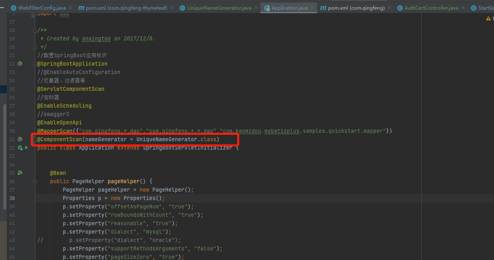
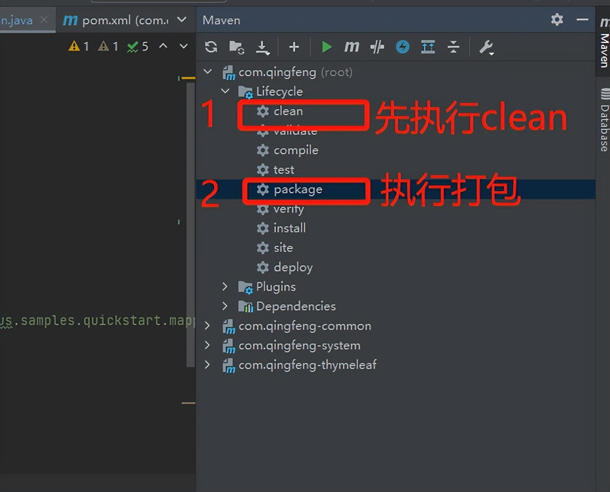
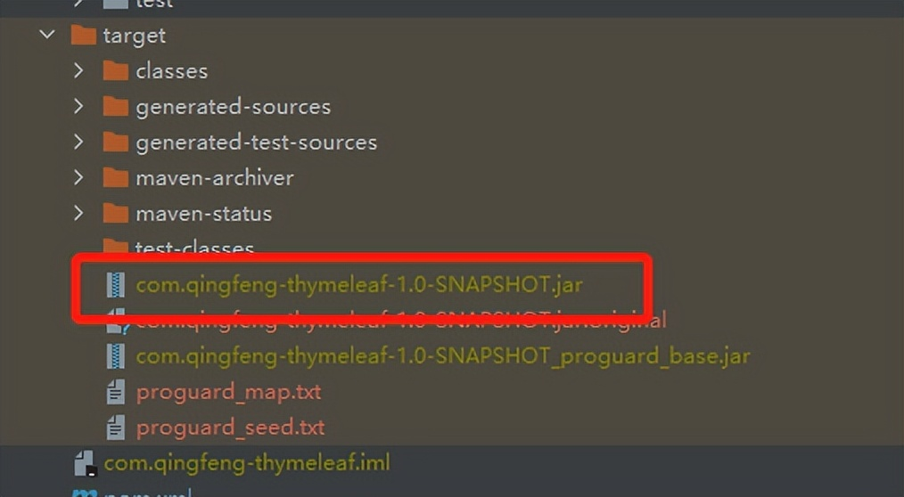
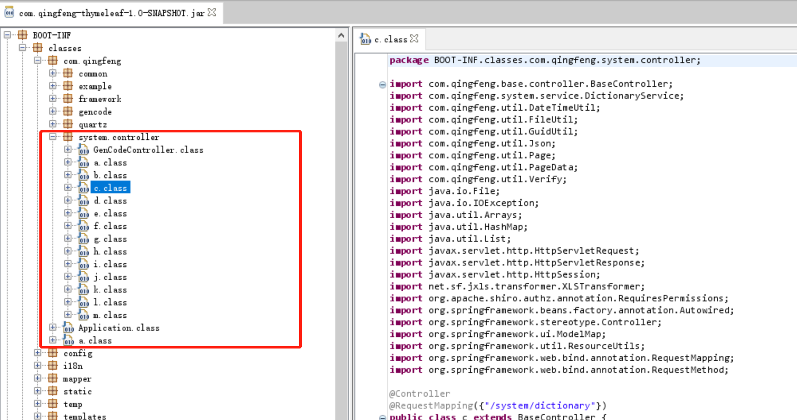
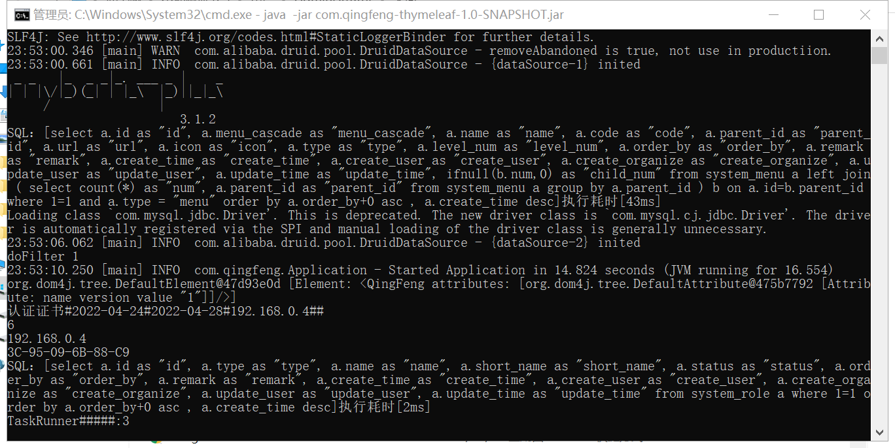
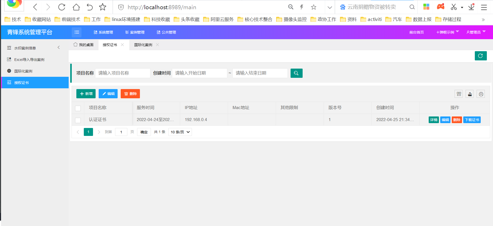

# Springboot整合ProGuard实现代码混淆

# 今日分享

每天分享技术实战干货，技术在于积累和收藏，希望可以帮助到您。

架构开源地址：https://gitee.com/msxy

# ProGuard简介

ProGuard是一个混淆代码的开源项目，它的主要作用是混淆代码，ProGuard还包括以下4个功能。

1. 压缩(Shrink)：检测并移除代码中无用的类、字段、方法和特性（Attribute）。
2. 优化(Optimize)：对字节码进行优化，移除无用的指令。
3. 混淆(Obfuscate)：使用a，b，c，d这样简短而无意义的名称，对类、字段和方法进行重命名。
4. 预检(Preveirfy)：在Java平台上对处理后的代码进行预检，确保加载的class文件是可执行的。

Proguard是一个Java类文件压缩器、优化器、混淆器、预校验器。压缩环节会检测以及移除没有用到的类、字段、方法以及属性。优化环节会分析以及优化方法的字节码。混淆环节会用无意义的短变量去重命名类、变量、方法。这些步骤让代码更精简，更高效，也更难被逆向（破解）。

# Springboot整合ProGuard代码混淆

在pom中加入插件

```
 <!-- proguard混淆插件-->
            <plugin>
                <groupId>com.github.wvengen</groupId>
                <artifactId>proguard-maven-plugin</artifactId>
                <version>2.2.0</version>
                <executions>
                    <execution>
                        <!-- 打包的时候开始混淆-->
                        <phase>package</phase>
                        <goals>
                            <goal>proguard</goal>
                        </goals>
                    </execution>
                </executions>
                <configuration>
                    <injar>${project.build.finalName}.jar</injar>
                    <!--输出的jar-->
                    <outjar>${project.build.finalName}.jar</outjar>
                    <!-- 是否混淆-->
                    <obfuscate>true</obfuscate>
                    <options>
                        <option>-target 1.8</option> <!--指定java版本号-->
                        <option>-dontshrink</option> <!--默认开启，不做收缩（删除注释、未被引用代码）-->
                        <option>-dontoptimize</option><!--默认是开启的，这里关闭字节码级别的优化-->
                        <!-- 不路过非公用类文件及成员-->
                        <option>-dontskipnonpubliclibraryclasses</option>
                        <option>-dontskipnonpubliclibraryclassmembers</option>
                        <!--不用大小写混合类名机制-->
                        <option>-dontusemixedcaseclassnames</option>
                        <!-- 优化时允许访问并修改有修饰符的类和类的成员 -->
                        <option>-allowaccessmodification</option>
                        <!-- 确定统一的混淆类的成员名称来增加混淆-->
                        <option>-useuniqueclassmembernames</option>
                        <!-- 不混淆所有包名-->
                        <!--<option>-keeppackagenames</option>-->

                        <option>-adaptclassstrings</option><!--混淆类名之后，对使用Class.forName('className')之类的地方进行相应替代-->
                        <option>-ignorewarnings
                        </option><!-- 忽略warn消息,如果提示org.apache.http.* 这个包里的类有问题，那么就加入下述代码：-keep class org.apache.http.** { *; }    -dontwarn org.apache.http.**-->
                        <option>-keep class org.apache.logging.log4j.util.* { *; }</option>
                        <option>-dontwarn org.apache.logging.log4j.util.**</option>
                        <option>-keepattributes
                            Exceptions,InnerClasses,Signature,Deprecated,SourceFile,LineNumberTable,*Annotation*,EnclosingMethod
                        </option><!--对异常、注解信息在runtime予以保留，不然影响springboot启动-->
                        <!--不混淆所有interface接口-->
                        <!--                        <option>-keepnames interface **</option>-->
                        <option>-keepclassmembers enum * { *; }</option><!--保留枚举成员及方法-->
                        <option>-keepparameternames</option>
                        <option>-keepclasseswithmembers public class * {
                            public static void main(java.lang.String[]);}
                        </option> <!--保留main方法的类及其方法名-->
                        <!--忽略note消息，如果提示javax.annotation有问题，那麽就加入以下代码-->
                        <option>-dontnote javax.annotation.**</option>
                        <option>-dontnote sun.applet.**</option>
                        <option>-dontnote sun.tools.jar.**</option>
                        <option>-dontnote org.apache.commons.logging.**</option>
                        <option>-dontnote javax.inject.**</option>
                        <option>-dontnote org.aopalliance.intercept.**</option>
                        <option>-dontnote org.aopalliance.aop.**</option>
                        <option>-dontnote org.apache.logging.log4j.**</option>

                        <!--  ##### 以下为需要根据项目情况修改 comment by 青锋  ##### -->
                        <!--入口程序类不能混淆，混淆会导致springboot启动不了-->
                        <option>-keep class com.qingfeng.Application</option>
                        <option>-keep class com.qingfeng.framework.**.* {*;}</option>
                        <option>-keep class com.qingfeng.quartz.**.* {*;}</option>
<!--                        <option>-keep class com.qingfeng.system.entity.* {*;}</option>-->
<!--                        <option>-keep class com.qingfeng.system.model.* {*;}</option>-->
<!--                        <option>-keep class com.qingfeng.system.controller.* {*;}</option>-->
                        <!--  ##### 以上为需要根据项目情况修改  comment by qingfeng ##### -->

                        <option>-keep interface * extends * { *; }</option>
                        <!--不混淆所有类,保存原始定义的注释-->
                        <option>-keepclassmembers class * {
                            @org.springframework.beans.factory.annotation.Autowired *;
                            @org.springframework.beans.factory.annotation.Value *;
                            }
                        </option>
                    </options>
                    <libs>
                        <!-- 添加依赖 java8-->
                        <lib>${java.home}/lib/rt.jar</lib>
                        <lib>${java.home}/lib/jce.jar</lib>
                    </libs>
                </configuration>
                <dependencies>
                    <!-- https://mvnrepository.com/artifact/net.sf.proguard/proguard-base -->
                    <dependency>
                        <groupId>net.sf.proguard</groupId>
                        <artifactId>proguard-base</artifactId>
                        <version>6.1.1</version>
                    </dependency>
                </dependencies>
            </plugin>

            <!--Springboot repackage 打包-->
            <plugin>
                <groupId>org.springframework.boot</groupId>
                <artifactId>spring-boot-maven-plugin</artifactId>
                <executions>
                    <execution>
                        <!-- spingboot 打包需要repackage否则不是可执行jar -->
                        <goals>
                            <goal>repackage</goal>
                        </goals>
                        <configuration>
                            <mainClass>com.qingfeng.Application</mainClass>
                        </configuration>
                    </execution>
                </executions>
            </plugin>
```

# 问题：

1.由于在混淆后代码a.class,b.class,c.class等方式，会导致springboot注入bean的时候报bean冲突，需要对生成bean策略进行修改，添加类：

```
package com.qingfeng;

import org.springframework.beans.factory.config.BeanDefinition;
import org.springframework.beans.factory.support.BeanDefinitionRegistry;
import org.springframework.context.annotation.AnnotationBeanNameGenerator;

/** * @author Administrator * @version 1.0.0 * @ProjectName qingfengThymeleaf * @Description sping下代码混淆后，不同包下的bean名相同会报bean冲突 * @createTime 2022年04月25日 22:59:00 */
public class UniqueNameGenerator extends AnnotationBeanNameGenerator {
    @Override
    public String generateBeanName(BeanDefinition definition, BeanDefinitionRegistry registry) {
        //全限定类名
        String beanName = definition.getBeanClassName();
        return beanName;
    }
}
```

```
@ComponentScan(nameGenerator = UniqueNameGenerator.class)
```



# 执行maven打包





# jd-gui查看编译后的class文件

打包之后，查看打包后的代码



# 项目运行



