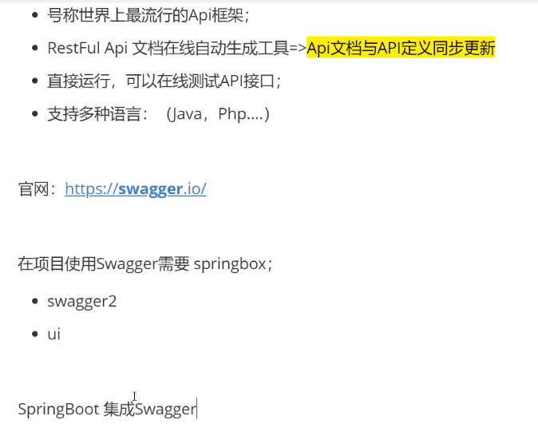
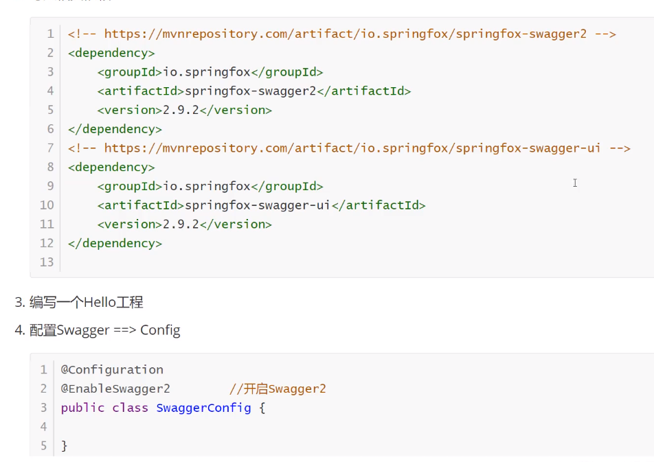
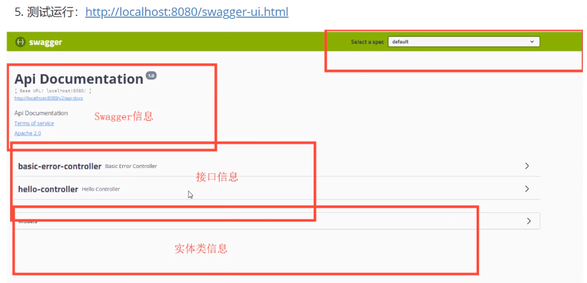
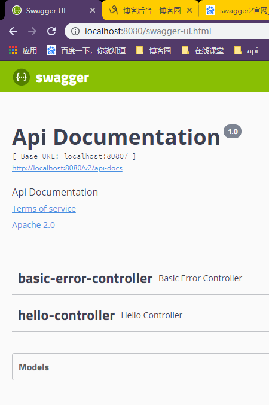
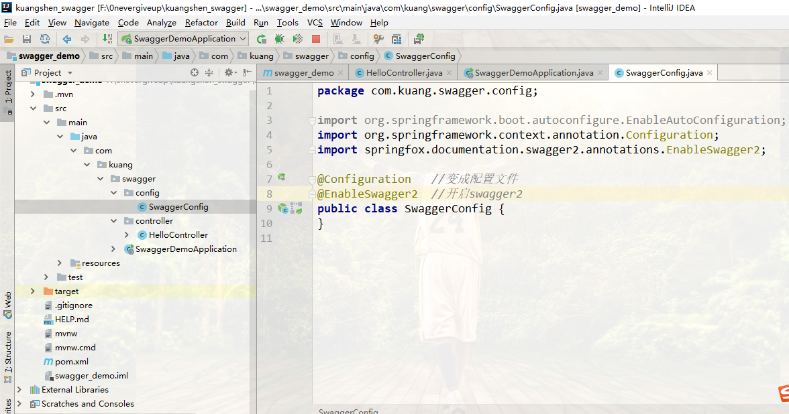

# Swagger学习（一、入门） #











SwaggerConfig.class

```
@Configuration   //变成配置文件
@EnableSwagger2  //开启swagger2
public class SwaggerConfig {

}
```

pom.xml

```
<dependencies>
    <!--swagger-->
    <dependency>
        <groupId>io.springfox</groupId>
        <artifactId>springfox-swagger2</artifactId>
        <version>2.9.2</version>
    </dependency>

    <dependency>
        <groupId>io.springfox</groupId>
        <artifactId>springfox-swagger-ui</artifactId>
        <version>2.9.2</version>
    </dependency>

    <dependency>
        <groupId>org.springframework.boot</groupId>
        <artifactId>spring-boot-starter-web</artifactId>
    </dependency>

    <dependency>
        <groupId>org.springframework.boot</groupId>
        <artifactId>spring-boot-starter-test</artifactId>
        <scope>test</scope>
        <exclusions>
            <exclusion>
                <groupId>org.junit.vintage</groupId>
                <artifactId>junit-vintage-engine</artifactId>
            </exclusion>
        </exclusions>
    </dependency>
</dependencies>
```

HelloController.class

```
@RestController
public class HelloController {
    @RequestMapping("/hello")
    public String hello(){
        return "hello swagger";
    }
}

```

不要忘记Swagger的配置文件 SwaggerConfig.class就好了