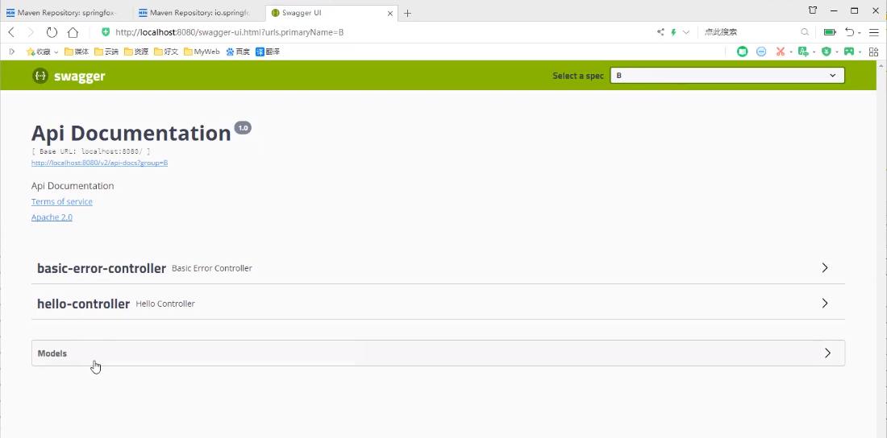
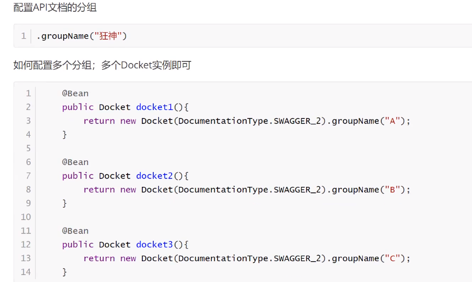
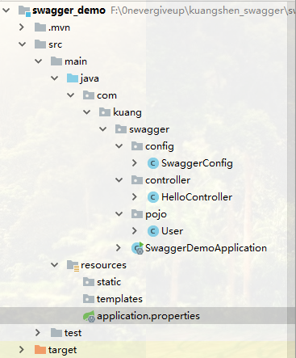
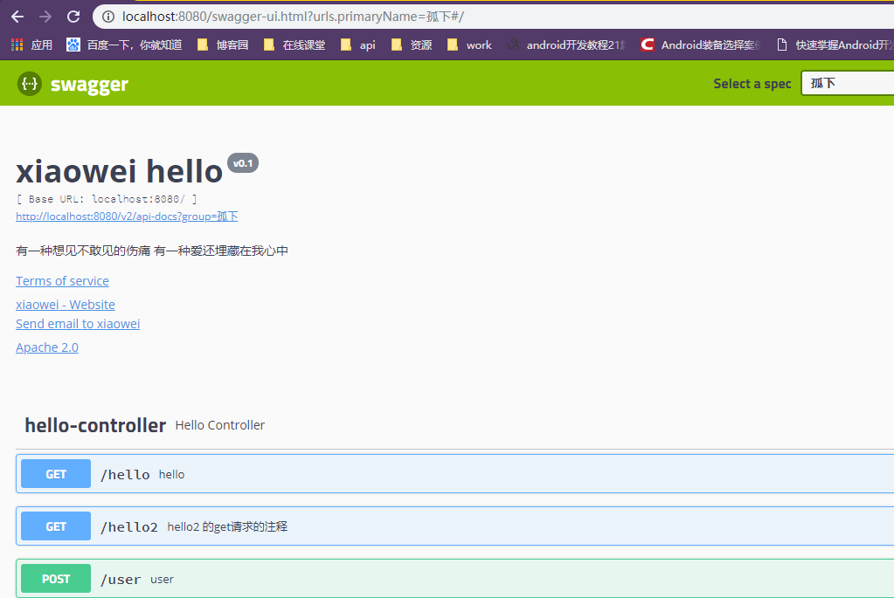

# Swagger学习（四、配置API文档的分组） #





完整示例

代码结构          



运行效果



SwaggerConfig.class

```
@Configuration   //变成配置文件
@EnableSwagger2  //开启swagger2
public class SwaggerConfig {
    @Bean
    public Docket docket01(){
        return new Docket(DocumentationType.SWAGGER_2)
                .groupName("洒家");
    }
    @Bean
    public Docket docket02(){
        return new Docket(DocumentationType.SWAGGER_2)
                .groupName("白水煮开一切");
    }
    @Bean  //配置swagger的docket的bean实例
    public Docket docket(){
        return new Docket(DocumentationType.SWAGGER_2)
                .apiInfo(apiInfo())
                .groupName("孤下")
                .enable(true)
                .select()
                .apis(RequestHandlerSelectors.basePackage("com.kuang.swagger.controller"))
                .build();
    }
    //配置swagger信息的ApiInfo
    private ApiInfo apiInfo(){
        //作者的联系方式
        Contact contact = new Contact("xiaowei","https://www.baidu.com","1102356056@qq.com");
        return new ApiInfo(
                "xiaowei hello",
                "有一种想见不敢见的伤痛 有一种爱还埋藏在我心中",
                "v0.1",
                "ttps://www.baidu.com",
                contact,
                "Apache 2.0",
                "http://www.apache.org/licenses/LICENSE-2.0",
                new ArrayList()
        );
    }
}
```

HelloController.class

```
@RestController
public class HelloController {
    @GetMapping(value = "/hello")
    public String hello(){
        return "hello swagger";
    }
    @ApiOperation("hello2 的get请求的注释")
    @GetMapping(value = "/hello2")
    public String hello2(String username){
        return "hello"+username;
    }
    //只要我们的接口中，返回值中存在实体类，他就会被扫描到swagger中
    @PostMapping(value = "/user")
    public User user(){
        int i=5/0;
        return new User();
    }
    @ApiOperation("user2 的post请求的注释")
    @PostMapping(value = "/user2")
    public User user2(@ApiParam("用户名") User user){
        return user;
    }
}
```

User.class

@ApiModel("用户实体类")
public class User {
    @ApiModelProperty("用户名")
    public String username;
    @ApiModelProperty("密码")
    public String password;
}

