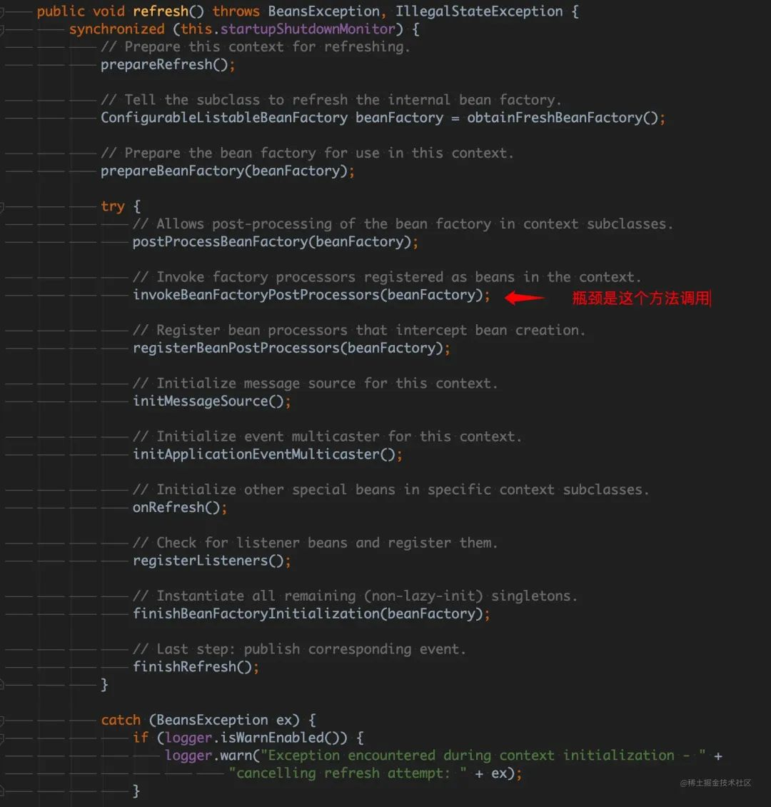
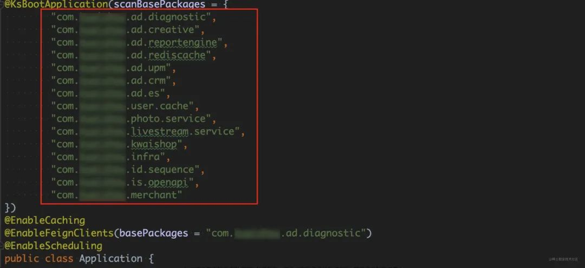
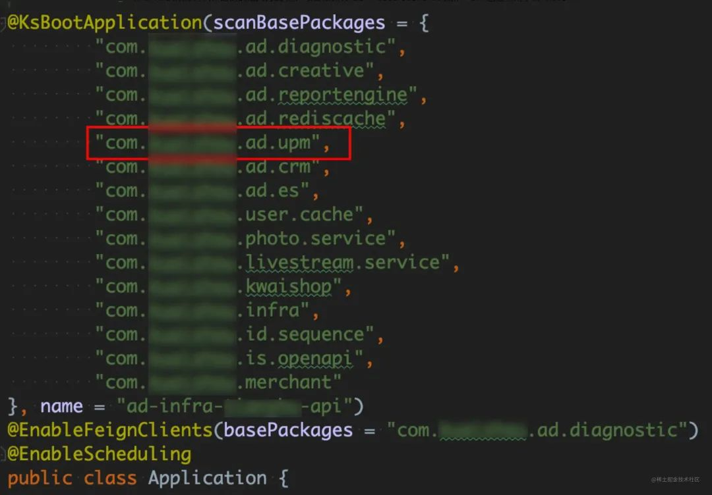
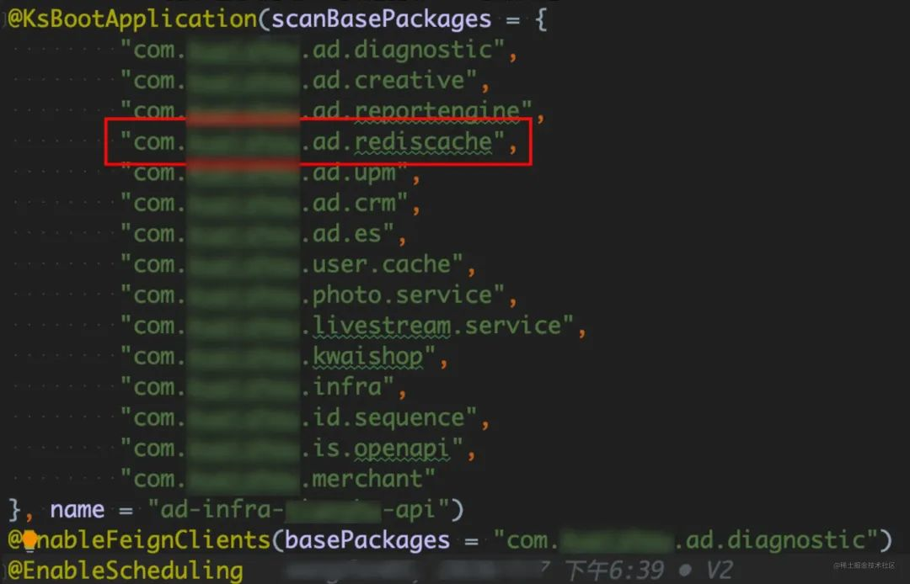
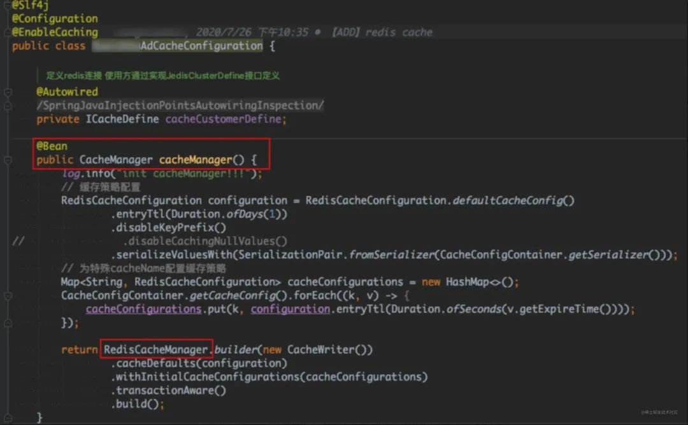
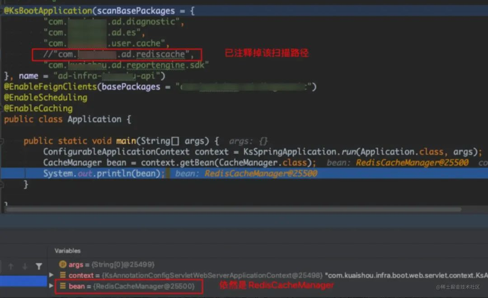
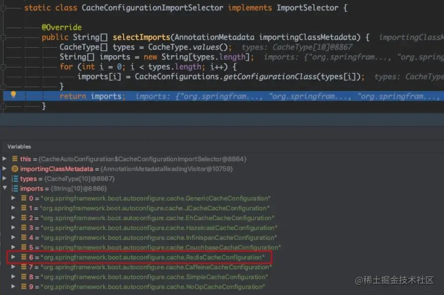

# 公司新入职一位大佬，把SpringBoot项目启动时间从7分钟降到了40秒！

> 作者：Debugger
>
> 来源：juejin.cn/post/7181342523728592955

## 背景

公司 SpringBoot 项目在日常开发过程中发现服务启动过程异常缓慢，常常需要6-7分钟才能暴露端口，严重降低开发效率。通过 SpringBoot 的 `SpringApplicationRunListener` 、`BeanPostProcessor` 原理和源码调试等手段排查发现，在 Bean 扫描和 Bean 注入这个两个阶段有很大的性能瓶颈。

通过 JavaConfig 注册 Bean， 减少 SpringBoot 的扫描路径，同时基于 Springboot 自动配置原理对第三方依赖优化改造，将服务本地启动时间从7min 降至40s 左右的过程。本文会涉及以下知识点：

- 基于 SpringApplicationRunListener 原理观察 SpringBoot 启动 run 方法；
- 基于 BeanPostProcessor 原理监控 Bean 注入耗时；
- SpringBoot Cache 自动化配置原理；
- SpringBoot 自动化配置原理及 starter 改造；

## 1 耗时问题排查

SpringBoot 服务启动耗时排查，目前有2个思路：

1. 排查 SpringBoot 服务的启动过程；
2. 排查 Bean 的初始化耗时；

### 1.1 观察 SpringBoot 启动 run 方法

该项目使用基于 SpringBoot 改造的内部微服务组件 XxBoot 作为服务端实现，其启动流程与 SpringBoot 类似，分为 `ApplicationContext` 构造和 `ApplicationContext` 启动两部分，即通过构造函数实例化 `ApplicationContext` 对象，并调用其 `run` 方法启动服务：

```
public class Application {
    public static void main(String[] args) {
        SpringApplication.run(Application.class, args);
    }
}

public static ConfigurableApplicationContext run(Class<?>[] primarySources, String[] args) {
    return new SpringApplication(primarySources).run(args);
}
```

`ApplicationContext` 对象构造过程，主要做了自定义 Banner 设置、应用类型推断、配置源设置等工作，不做特殊扩展的话，大部分项目都是差不多的，不太可能引起耗时问题。通过在 `run` 方法中打断点，启动后很快就运行到断点位置，也能验证这一点。接下就是重点排查 `run` 方法的启动过程中有哪些性能瓶颈？SpringBoot 的启动过程非常复杂，庆幸的是 SpringBoot 本身提供的一些机制，将 SpringBoot 的启动过程划分了多个阶段，这个阶段划分的过程就体现在 `SpringApplicationRunListener` 接口中，该接口将 `ApplicationContext` 对象的 `run` 方法划分成不同的阶段：

```
public interface SpringApplicationRunListener {
    // run 方法第一次被执行时调用，早期初始化工作
    void starting();
    // environment 创建后，ApplicationContext 创建前
    void environmentPrepared(ConfigurableEnvironment environment);
    // ApplicationContext 实例创建，部分属性设置了
    void contextPrepared(ConfigurableApplicationContext context);
    // ApplicationContext 加载后，refresh 前
    void contextLoaded(ConfigurableApplicationContext context);
    // refresh 后
    void started(ConfigurableApplicationContext context);
    // 所有初始化完成后，run 结束前
    void running(ConfigurableApplicationContext context);
    // 初始化失败后
    void failed(ConfigurableApplicationContext context, Throwable exception);
}
```

目前，SpringBoot 中自带的 `SpringApplicationRunListener` 接口只有一个实现类：`EventPublishingRunListener`，该实现类作用：通过观察者模式的事件机制，在 `run` 方法的不同阶段触发 `Event` 事件，`ApplicationListener` 的实现类们通过监听不同的 `Event` 事件对象触发不同的业务处理逻辑。

> 通过自定义实现 `ApplicationListener` 实现类，可以在 SpringBoot 启动的不同阶段，实现一定的处理，可见`SpringApplicationRunListener` 接口给 `SpringBoot` 带来了扩展性。

这里我们不必深究实现类 `EventPublishingRunListener` 的功能，但是可以通过 `SpringApplicationRunListener` 原理，**添加一个自定义的实现类，在不同阶段结束时打印下当前时间，通过计算不同阶段的运行时间，就能大体定位哪些阶段耗时比较高**，然后重点排查这些阶段的代码。先看下 `SpringApplicationRunListener` 的实现原理，其划分不同阶段的逻辑体现在 `ApplicationContext` 的 `run` 方法中：

```
public ConfigurableApplicationContext run(String... args) {
    ...
    // 加载所有 SpringApplicationRunListener 的实现类
    SpringApplicationRunListeners listeners = getRunListeners(args);
    // 调用了 starting
    listeners.starting();
    try {
        ApplicationArguments applicationArguments = new DefaultApplicationArguments(args);
        // 调用了 environmentPrepared
        ConfigurableEnvironment environment = prepareEnvironment(listeners, applicationArguments);
        configureIgnoreBeanInfo(environment);
        Banner printedBanner = printBanner(environment);
        context = createApplicationContext();
        exceptionReporters = getSpringFactoriesInstances(SpringBootExceptionReporter.class, new Class[] { ConfigurableApplicationContext.class }, context);
        // 内部调用了 contextPrepared、contextLoaded
        prepareContext(context, environment, listeners, applicationArguments, printedBanner);
        refreshContext(context);
        afterRefresh(context, applicationArguments);
        stopWatch.stop();
        if (this.logStartupInfo) {
            new StartupInfoLogger(this.mainApplicationClass).logStarted(getApplicationLog(), stopWatch);
        }
        // 调用了 started
        listeners.started(context);
        callRunners(context, applicationArguments);
    }
    catch (Throwable ex) {
        // 内部调用了 failed
        handleRunFailure(context, ex, exceptionReporters, listeners);
        throw new IllegalStateException(ex);
    }
    try {
        // 调用了 running
        listeners.running(context);
    }
    catch (Throwable ex) {
        handleRunFailure(context, ex, exceptionReporters, null);
        throw new IllegalStateException(ex);
    }
    return context;
}
```

`run` 方法中 `getRunListeners(args)` 通过 `SpringFactoriesLoader` 加载 `classpath` 下 `META-INF/spring.factotries` 中配置的所有 `SpringApplicationRunListener` 的实现类，通过反射实例化后，存到局部变量 `listeners` 中，其类型为 `SpringApplicationRunListeners`；然后在 `run` 方法不同阶段通过调用 `listeners` 的不同阶段方法来触发 `SpringApplicationRunListener` 所有实现类的阶段方法调用。

因此，只要编写一个 `SpringApplicationRunListener` 的自定义实现类，在实现接口不同阶段方法时，打印当前时间；并在 `META-INF/spring.factotries` 中配置该类后，该类也会实例化，存到 `listeners` 中；在不同阶段结束时打印结束时间，以此来评估不同阶段的执行耗时。在项目中添加实现类 `MySpringApplicationRunListener` ：

```
@Slf4j
public class MySpringApplicationRunListener implements SpringApplicationRunListener {
    // 这个构造函数不能少，否则反射生成实例会报错
    public MySpringApplicationRunListener(SpringApplication sa, String[] args) {
    }
    @Override
    public void starting() {
        log.info("starting {}", LocalDateTime.now());
    }
    @Override
    public void environmentPrepared(ConfigurableEnvironment environment) {
        log.info("environmentPrepared {}", LocalDateTime.now());
    }
    @Override
    public void contextPrepared(ConfigurableApplicationContext context) {
        log.info("contextPrepared {}", LocalDateTime.now());
    }
    @Override
    public void contextLoaded(ConfigurableApplicationContext context) {
        log.info("contextLoaded {}", LocalDateTime.now());
    }
    @Override
    public void started(ConfigurableApplicationContext context) {
        log.info("started {}", LocalDateTime.now());
    }
    @Override
    public void running(ConfigurableApplicationContext context) {
        log.info("running {}", LocalDateTime.now());
    }
    @Override
    public void failed(ConfigurableApplicationContext context, Throwable exception) {
        log.info("failed {}", LocalDateTime.now());
    }
}
```

**这边 (SpringApplication sa, String[] args) 参数类型的构造函数不能少**，因为源码中限定了使用该参数类型的构造函数反射生成实例。

在 `resources` 文件下的 `META-INF/spring.factotries` 文件中配置上该类：

```
# Run Listeners
org.springframework.boot.SpringApplicationRunListener=\
com.xxx.ad.diagnostic.tools.api.MySpringApplicationRunListener
```

> `run` 方法中是通过 `getSpringFactoriesInstances` 方法来获取 `META-INF/spring.factotries` 下配置的 `SpringApplicationRunListener` 的实现类，其底层是依赖 `SpringFactoriesLoader` 来获取配置的类的全限定类名，然后反射生成实例；这种方式在 SpringBoot 用的非常多，如 `EnableAutoConfiguration`、`ApplicationListener`、`ApplicationContextInitializer` 等。

重启服务，观察 `MySpringApplicationRunListener` 的日志输出，发现主要耗时都在 `contextLoaded` 和 `started` 两个阶段之间，在这两个阶段之间调用了2个方法：`refreshContext` 和 `afterRefresh` 方法，而 `refreshContext` 底层调用的是 `AbstractApplicationContext#refresh`，Spring 初始化 context 的核心方法之一就是这个 `refresh`。至此基本可以断定，高耗时的原因就是在初始化 Spring 的 context，然而这个方法依然十分复杂，好在 refresh 方法也将初始化 Spring 的 context 的过程做了整理，并详细注释了各个步骤的作用：通过简单调试，很快就定位了高耗时的原因：

1. 在 `invokeBeanFactoryPostProcessors(beanFactory)` 方法中，调用了所有注册的 `BeanFactory` 的后置处理器；
2. 其中，`ConfigurationClassPostProcessor` 这个后置处理器贡献了大部分的耗时；
3. 查阅相关资料，该后置处理器相当重要，主要负责`@Configuration`、`@ComponentScan`、`@Import`、`@Bean` 等注解的解析；
4. 继续调试发现，主要耗时都花在主配置类的 `@ComponentScan` 解析上，而且主要耗时还是在解析属性 `basePackages`；

即项目主配置类上 `@SpringBootApplication` 注解的 `scanBasePackages` 属性：通过该方法 JavaDoc、查看相关代码，大体了解到该过程是在递归扫描、解析 `basePackages` 所有路径下的 class，对于可作为 Bean 的对象，生成其 `BeanDefinition`；如果遇到 `@Configuration` 注解的配置类，还得递归解析其 `@ComponentScan`。至此，服务启动缓慢的原因就找到了：

1. 作为数据平台，我们的服务引用了很多第三方依赖服务，这些依赖往往提供了对应业务的完整功能，所以提供的 jar 包非常大；
2. 扫描这些包路径下的 class 非常耗时，很多 class 都不提供 Bean，但还是花时间扫描了；
3. 每添加一个服务的依赖，都会线性增加扫描的时间；

弄明白耗时的原因后，我有2个疑问：

1. 是否所有的 class 都需要扫描，是否可以只扫描那些提供 Bean 的 class？
2. 扫描出来的 Bean 是否都需要？我只接入一个功能，但是注入了所有的 Bean，这似乎不太合理？

### 1.2 监控 Bean 注入耗时

第二个优化的思路是监控所有 Bean 对象初始化的耗时，即每个 Bean 对象实例化、初始化、注册所花费的时间，有没有特别耗时 Bean 对象？同样的，我们可以利用 SpringBoot 提供了 `BeanPostProcessor` 接口来监控 Bean 的注入耗时，`BeanPostProcessor` 是 Spring 提供的 Bean 初始化前后的 IOC 钩子，用于在 Bean 初始化的前后执行一些自定义的逻辑：

```
public interface BeanPostProcessor {
    // 初始化前
    default Object postProcessBeforeInitialization(Object bean, String beanName) throws BeansException {
        return bean;
    }
    // 初始化后
    default Object postProcessAfterInitialization(Object bean, String beanName) throws BeansException {
        return bean;
    }   
}
```

对于 `BeanPostProcessor` 接口的实现类，其前后置处理过程体现在 `AbstractAutowireCapableBeanFactory#doCreateBean`，这也是 Spring 中非常重要的一个方法，用于真正实例化 Bean 对象，通过 `BeanFactory#getBean` 方法一路 Debug 就能找到。在该方法中调用了 `initializeBean` 方法：

```
protected Object initializeBean(String beanName, Object bean, @Nullable RootBeanDefinition mbd) {
    ...
    Object wrappedBean = bean;
    if (mbd == null || !mbd.isSynthetic()) {
        // 应用所有 BeanPostProcessor 的前置方法
        wrappedBean = applyBeanPostProcessorsBeforeInitialization(wrappedBean, beanName);
    }
    try {
        invokeInitMethods(beanName, wrappedBean, mbd);
    }
    catch (Throwable ex) {
        throw new BeanCreationException(
                (mbd != null ? mbd.getResourceDescription() : null),
                beanName, "Invocation of init method failed", ex);
    }
    if (mbd == null || !mbd.isSynthetic()) {
        // 应用所有 BeanPostProcessor 的后置方法
        wrappedBean = applyBeanPostProcessorsAfterInitialization(wrappedBean, beanName);
    }
    return wrappedBean;
}
```

通过 `BeanPostProcessor` 原理，在前置处理时记录下当前时间，在后置处理时，用当前时间减去前置处理时间，就能知道每个 Bean 的初始化耗时，下面是我的实现：

```
@Component
public class TimeCostBeanPostProcessor implements BeanPostProcessor {
    private Map<String, Long> costMap = Maps.newConcurrentMap();
  
    @Override
    public Object postProcessBeforeInitialization(Object bean, String beanName) throws BeansException {
        costMap.put(beanName, System.currentTimeMillis());
        return bean;
    }
    @Override
    public Object postProcessAfterInitialization(Object bean, String beanName) throws BeansException {
        if (costMap.containsKey(beanName)) {
            Long start = costMap.get(beanName);
            long cost  = System.currentTimeMillis() - start;
            if (cost > 0) {
                costMap.put(beanName, cost);
                System.out.println("bean: " + beanName + "\ttime: " + cost);
            }
        }
        return bean;
    }
}
```

`BeanPostProcessor` 的逻辑是在 `Beanfactory` 准备好后处理的，就不需要通过 `SpringFactoriesLoader` 加载了，直接 `@Component` 注入即可。

重启服务，通过以上方法排查 Bean 初始化过程，还真的有所发现：这个 Bean 初始化耗时43s，具体看下这个 Bean 的初始化方法，发现会从数据库查询大量配置元数据，并更新到 Redis 缓存中，所以初始化非常慢：另外，还发现了一些非项目自身服务的service、controller对象，这些 Bean 来自于第三方依赖：UPM服务，项目中并不需要：其实，原因上文已经提到：我只接入一个功能，但我注入了该服务路径下所有的 Bean，也就是说，服务里注入其他服务的、对自身无用的 Bean。

## 2 优化方案

### 2.1 如何解决扫描路径过多？

想到的解决方案比较简单粗暴：梳理要引入的 Bean，删掉主配置类上扫描路径，使用 JavaConfig 的方式显式手动注入。以 UPM 的依赖为例，**之前的注入方式** 是，项目依赖其 UpmResourceClient 对象，Pom 已经引用了其 Maven 坐标，并在主配置类上的 `scanBasePackages` 中添加了其服务路径："com.xxx.ad.upm"，通过扫描整个服务路径下的 class，找到 UpmResourceClient 并注入，因为该类注解了 `@Service`，因此会注入到服务的 Spring 上下文中，UpmResourceClient 源码片段及主配置类如下：

使用 JavaConfig 的改造方式是：不再扫描 UPM 的服务路径，而是主动注入。删除"com.xxx.ad.upm"，并在服务路径下添加以下配置类：

```
@Configuration
public class ThirdPartyBeanConfig {
    @Bean
    public UpmResourceClient upmResourceClient() {
        return new UpmResourceClient();
    }
}
```

> Tips：如果该 Bean 还依赖其他 Bean，则需要把所依赖的 Bean 都注入；针对 Bean 依赖情况复杂的场景梳理起来就比较麻烦了，所幸项目用到的服务 Bean 依赖关系都比较简单，一些依赖关系复杂的服务，观察到其路径扫描耗时也不是很高，就不处理了。

同时，通过 JavaConfig 按需注入的方式，就不存在冗余 Bean 的情况了，也有利于降低服务的内存消耗；解决了上面的引入无关的 upmService、upmController 的问题。

### 2.2 如何解决 Bean 初始化高耗时？

Bean 初始化耗时高，就需要 case by case 地处理了，比如项目中遇到的初始化配置元数据的问题，可以考虑通过将该任务提交到线程池的方式异步处理或者懒加载的方式来解决。

## 3 新的问题

完成以上优化后，本地启动时间从之前的 7min 左右降低至 40s，效果还是非常显著的。本地自测通过后，便发布到预发进行验证，验证过程中，有同学发现项目接入的 Redis 缓存组件失效了。该组件接入方式与上文描述的接入方式类似，通过添加扫描服务的根路径"com.xxx.ad.rediscache"，注入对应的 Bean 对象；查看该缓存组件项目的源码，发现该路径下有一个 config 类注入了一个缓存管理对象 `CacheManager`，其实现类是 `RedisCacheManager`：缓存组件代码片段：本次优化中，我是通过 **每次删除一条扫描路径，启动服务后根据启动日志中 Bean 缺失错误的信息，来逐个梳理、添加依赖的 Bean，保证服务正常启动** 的方式来改造的，而删除"com.xxx.ad.rediscache"后启动服务并无异常，因此就没有进一步的操作，直接上预发验证了。这就奇怪了，既然不扫描该组件的业务代码根路径，也就没有执行注入该组件中定义的 `CacheManager` 对象，为啥用到缓存的地方没有报错呢？尝试在未添加扫描路径的情况下，从 `ApplicationContext` 中获取 `CacheManager` 类型的对象看下是否存在？结果发现确实存在 `RedisCacheManager` 对象：其实，前面的分析并没有错，删除扫描路径后生成的 `RedisCacheManager` 并不是缓存组件代码中配置的，而是 SpringBoot 的自动化配置生成的，也就是说该对象并不是我们想要的对象，是不符合预期的，下文介绍其原因。

### 3.1 SpringBoot 自动化装配，让人防不胜防

查阅 SpringBoot Cache 相关资料，发现 SpringBoot Cache 做了一些自动推断和注入的工作，原来是 SpringBoot 自动化装配的锅呀，接下来就分析下 SpringBoot Cache 原理，明确出现以上问题的原因。SpringBoot 自动化配置，体现在主配置类上复合注解 `@SpringBootApplication` 中的`@EnableAutoConfiguration` 上，该注解开启了 SpringBoot 的自动配置功能。该注解中的`@Import(AutoConfigurationImportSelector.class)` 通过加载 `META-INF/spring.factotries` 下配置一系列 *AutoConfiguration 配置类，根据现有条件推断，尽可能地为我们配置需要的 Bean。这些配置类负责各个功能的自动化配置，其中用于 SpringBoot Cache 的自动配置类是 `CacheAutoConfiguration`，接下来重点分析这个配置类就行了。

> `@SpringBootApplication` 复合注解中集成了三个非常重要的注解：`@SpringBootConfiguration`、`@EnableAutoConfiguration`、`@ComponentScan`，其中 `@EnableAutoConfiguration` 就是负责开启自动化配置功能；SpringBoot 中有多 `@EnableXXX` 的注解，都是用来开启某一方面的功能，其实现原理也是类似的：通过 `@Import` 筛选、导入满足条件的自动化配置类。

可以看到 `CacheAutoConfiguration` 上有许多注解，重点关注下`@Import({CacheConfigurationImportSelector.class})`，`CacheConfigurationImportSelector` 实现了 `ImportSelector` 接口，该接口用于动态选择想导入的配置类，这个 `CacheConfigurationImportSelector` 用来导入不同类型的 Cache 的自动配置类：

通过调试 `CacheConfigurationImportSelector` 发现，根据 SpringBoot 支持的缓存类型(CacheType)，提供了10种 cache 的自动配置类，按优先级排序，最终只有一个生效，而本项目中恰恰就是 `RedisCacheConfiguration`，其内部提供的是 `RedisCacheManager`，和引入第三方缓存组件一样，所以造成了困惑：看下 `RedisCacheConfiguration` 的实现：这个配置类上有很多条件注解，当这些条件都满足的话，这个自动配置类就会生效，而本项目恰恰都满足，同时项目主配置类上还加上了 `@EnableCaching`，开启了缓存功能，即使缓存组件没生效，SpringBoot 也会自动生成一个缓存管理对象；

即：缓存组件服务扫描路径存在的话，缓存组件中的代码生成缓存管理对象，`@ConditionalOnMissingBean(CacheManager.class)` 失效；扫描路径不存在的话，SpringBoot 通过推断，自动生成一个缓存管理对象。

这个也很好验证，在 `RedisCacheConfiguration` 中打断点，不删除扫描路径是走不到这边的SpringBoot 自动装配过程的(缓存组件显式生成过了)，删除了扫描路径是能走到的(SpringBoot 自动生成)。

> 上文多次提到@Import，这是 SpringBoot 中重要注解，主要有以下作用：1、导入 `@Configuration` 注解的类；2、导入实现了 `ImportSelector` 或 `ImportBeanDefinitionRegistrar` 的类；3、导入普通的 POJO。

### 3.2 使用 starter 机制，开箱即用

了解缓存失效的原因后，就有解决的办法了，因为是自己团队的组件，就没必要通过 JavaConfig 显式手动导入的方式改造，而是通过 SpringBoot 的 starter 机制，优化下缓存组件的实现，可以做到自动注入、开箱即用。只要改造下缓存组件的代码，在 `resources` 文件中添加一个 `META-INF/spring.factotries` 文件，在下面配置一个 `EnableAutoConfiguration` 即可，这样项目在启动时也会扫描到这个 jar 中的 `spring.factotries` 文件，将 `XxxAdCacheConfiguration` 配置类自动引入，而不需要扫描"com.xxx.ad.rediscache"整个路径了：

```
# EnableAutoConfigurations
org.springframework.boot.autoconfigure.EnableAutoConfiguration=\
com.xxx.ad.rediscache.XxxAdCacheConfiguration
```

> SpringBoot 的 `EnableAutoConfiguration` 自动配置原理还是比较复杂的，在加载自动配置类前还要先加载自动配置的元数据，对所有自动配置类做有效性筛选，具体可查阅 EnableAutoConfiguration 相关代码；

## 推荐阅读

- [和 if else说再见，SpringBoot 这样做参数校验才足够优雅！](https://mp.weixin.qq.com/s?__biz=MzU1Nzg4NjgyMw==&mid=2247507619&idx=1&sn=81e07e245e5c0c1e3e1af711148fef2b&scene=21#wechat_redirect)
- [用一个月重构了同事写的烂代码，我总结了8条重写烂代码的经验！](https://mp.weixin.qq.com/s?__biz=MzU1Nzg4NjgyMw==&mid=2247507579&idx=1&sn=edd93c9f527c880385b459fed51c9ab4&scene=21#wechat_redirect)
- [告警：线上慎用 ThreadLocal，坑的差点被开了！](https://mp.weixin.qq.com/s?__biz=MzU1Nzg4NjgyMw==&mid=2247507558&idx=1&sn=e35a0d35d2dfe3c575be0299a85cede8&scene=21#wechat_redirect)
- [你见过哪些目瞪口呆的 Java 代码技巧？](https://mp.weixin.qq.com/s?__biz=MzU1Nzg4NjgyMw==&mid=2247507539&idx=1&sn=41c70858bd6bca7cdee3d2deb5598e50&scene=21#wechat_redirect)
- [Controller层代码就该这么写，简洁又优雅！](https://mp.weixin.qq.com/s?__biz=MzU1Nzg4NjgyMw==&mid=2247507501&idx=1&sn=dcaddc2ee6816b9c0ee56418635fa2b9&scene=21#wechat_redirect)
- [看了我常用的接口文档定义技巧，同事也开始悄悄模仿了...](https://mp.weixin.qq.com/s?__biz=MzU1Nzg4NjgyMw==&mid=2247507483&idx=1&sn=19a2ba5c9443ba9d83b3e9b3634d9c40&scene=21#wechat_redirect)
- [重磅更新！Mall实战教程全面升级，瞬间高大上了！](https://mp.weixin.qq.com/s?__biz=MzU1Nzg4NjgyMw==&mid=2247499376&idx=1&sn=3ed28795cdd35fbaa3506e74a56703b0&scene=21#wechat_redirect)
- [40K+Star！Mall电商实战项目开源回忆录！](https://mp.weixin.qq.com/s?__biz=MzU1Nzg4NjgyMw==&mid=2247486684&idx=1&sn=807fd808adac8019eb2095ba088efe54&scene=21#wechat_redirect)