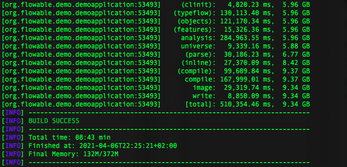

# 基于GraalVM构建的Flowable+SpringBoot本地镜像

[GraalVM](https://javakk.com/tag/graalvm)是一个来自Oracle的JDK，它有一些非常有趣的技术，包括社区版和企业版。在某些工作负载上更快的运行时间，进行多语言编程的有趣方法，以及本文的重点：将Java应用程序编译为本机映像。这样一个本机映像是一个优化的二进制文件，它包含了在特定环境下运行Java应用程序所需的一切—它是针对特定系统编译的，以便本机运行。它包含在构建时计算的最小类集，并且启动速度非常快，因为它不会遭受初始化常规JDK的典型缓慢。

当服务需要快速启动，您需要为资源消耗付费时，这一点变得非常重要。由于核心的可流动架构原则之一是轻量级，因此这种能力非常适合我们。

在我们之前的工作中，以下几点仍然是开放的：

- 我们在没有持久性的情况下运行，使用可流动持久性接口的内存实现——让JDBC在那个时候工作是完全不可能的。
- 我们使用提前编译（AOT）将bpmn2.0模型编译为Java表示，以跳过XML解析和部署阶段。对于需要在开箱即用中烘焙模型的特定服务来说，这仍然是一件有价值的事情。然而，我们从来没有让XML模型在[GraalVM](https://javakk.com/tag/graalvm)上工作，对于一般用例来说，这是必须的。
- 我们可以用springfu来建立一个本地的镜像，但是没有springboot。早在那一天，springboot就承认了这一点。说实话，使SpringBoot与GraalVM兼容的工作量是一项巨大的任务。

所以，你可以想象当我们看到最近发布的Spring原生测试版时我们的兴奋。阅读文档并浏览springnative的源代码使我们确信这是springboot团队的一个重要且非常有趣的工程。

对它的恭敬回应是确保Flowable可以在这个本地环境中运行。所以我们就是这么做的。

## 本机FLOWABLE的路径

我们想要达到的目标：

- 使用一个用户任务部署一个简单的BPMN2.0流程模型
- 每秒启动一个流程实例
- 打印任务量
- 所有这些都需要一个持久的数据库

在本节中，我们将介绍使其工作所需的各种步骤。所有这些都是非常技术和相当枯燥的阅读。然而，我们花了很多（很多！）花了好几个小时来理解所有涉及到的细节，以及GraalVM构建系统是如何工作的……所以在这里写下来对我们来说也是一种治疗方法。

如果细节对你来说无关紧要，你可以在这里找到最终的结果：

*https://github.com/flowable/flowable-examples/tree/master/blog/04-2021-flowable-spring-boot-native*

首先，我们按照[Spring Native](https://javakk.com/tag/spring-native)文档开始建立一个基本的Maven项目。选择Postgresql作为数据库（因为该驱动程序在GraalVM上工作）并包括Flowable是添加以下依赖项的问题：

```
<dependency>
   <groupId>org.postgresql</groupId>
   <artifactId>postgresql</artifactId>
   <scope>runtime</scope>
</dependency>

<dependency>
   <groupId>org.flowable</groupId>
   <artifactId>flowable-spring-boot-starter-process</artifactId>
   <version>6.6.0</version>
</dependency>
```

[Spring Boot](https://javakk.com/tag/spring-boot)应用程序是非常标准的，它使用Flowable的流程引擎和服务来部署和启动流程实例：

```
@SpringBootApplication
public class DemoApplication {

   public static void main(String[] args) {
      SpringApplication.run(DemoApplication.class, args);
   }

   @Bean
   public CommandLineRunner commandLineRunner(ProcessEngine processEngine) {
      return args -> {
         processEngine.getRepositoryService().createDeployment()
            .disableSchemaValidation()
            .addClasspathResource("org/flowable/test.bpmn20.xml")
            .deploy();

         while (true) {
            processEngine.getRuntimeService().startProcessInstanceByKey("oneTaskProcess");
            System.out.println("Number of tasks: " 
                + processEngine.getTaskService().createTaskQuery().count());
            Thread.sleep(1000);
         }
      };
   }

}
```

在构建本机映像时，GraalVM将反省源代码并确定映像中需要包含哪些类。当然，由于许多Java库使用反射，许多类将被忽略。这些类需要添加到GraalVM配置文件中，这意味着在确定要包含哪些类时需要进行大量的反复试验。

[Spring Native](https://javakk.com/tag/spring-native)有一种基于注释生成此配置文件的简洁方法。它使用Maven插件，在构建时检查注释并生成配置文件。我们花了相当多的时间来实现这一点，在一个新的Maven模块中使用了如下的类（此处简化）：

```
@NativeHint(
    trigger = ProcessEngine.class,
    types = {
        @TypeHint(types = AppEngineServicesAutoConfiguration.class, access = AccessBits.ALL),
    },
    initialization = {
        @InitializationHint(
            types = {
                org.flowable.spring.boot.app.AppEngineServicesAutoConfiguration.class
            }
            , initTime = InitializationTime.BUILD)
    },
    resources = {
        @ResourceHint(patterns = "org/flowable/db/*")
    }
)
public class FlowableNativeHints implements NativeConfiguration {

    public FlowableNativeHints() {
    }

}
```

但是，我们无法使这种方法对我们起作用，只能自己配置JSON文件。我们将在不久的将来再次研究这个问题，因为对于定制项目来说，使用单独的模块要比手工添加配置容易得多。

第一个障碍是以下例外：

```
Parsing context:
parsing org.graalvm.polyglot.Engine.getVersion(Engine.java:203)
parsing com.oracle.truffle.js.scriptengine.GraalJSEngineFactory.getEngineVersion(GraalJSEngineFactory.java:132)
parsing com.oracle.truffle.js.scriptengine.GraalJSEngineFactory.getParameter(GraalJSEngineFactory.java:168)
```

幸运的是，我们在Github上找到了解决方案。将以下内容添加到GraalVM本机映像Maven插件中实现了这一点：

```
--features=org.graalvm.home.HomeFinderFeature
```

很难描述此时发生的尝试和错误的类型和数量。基本上，每次构建新的本机映像时，我们都会看到下一个失败的类，通常是由于反射引用。每一次构建都需要几分钟…这加起来很快。在进行了几次迭代之后，手动将Flowable类添加到该文件中，如下所示：

```
{
"name" : "org.flowable.spring.boot.app.AppEngineServicesAutoConfiguration",
"allPublicMethods" : true,
"allDeclaredConstructors" : true
}
```

我们决定做每个开发人员都会做的事情：自动化它。我们编写了几行代码，遍历了所有可流动包，并为所有可流动类生成了JSON配置。是的，这将包括图像中可能未使用的类，但它确实让我们更快地实现了我们想要实现的目标。我们确实删除了具有不可解析引用的类（例如，Junit、apachehttp）。在未来，我们当然要优化这一点。

由此，我们得到了如下配置文件：

*https://github.com/flowable/flowable-examples/blob/master/blog/04-2021-flowable-spring-boot-native/src/main/resources/META-INF/native-image/reflect-config.json*

在这一点上，我们走出了“`ClassNotFoundExceptionLand`”。由于缺少Flowable使用的资源文件，现在运行本机映像失败。通过使用GraalVM的自定义配置文件将它们包含在本机映像中，可以很容易地解决这一问题：

*https://github.com/flowable/flowable-examples/blob/master/blog/04-2021-flowable-spring-boot-native/src/main/resources/META-INF/native-image/resource-config.json*

我们为MyBatis做了类似的工作，并将相关类添加到`reflect-config.json`文件中。

下一个失败是我们用于数据库模式管理的Liquibase失败了。为了避免这种情况，直到GraalVM在本机上工作为止，我们在PostgreSQL中预先创建了一个模式，并将Spring引导应用程序配置为不自动创建任何模式。我们还必须在部署时禁用XSD验证，因为我们还不能在GraalVM上使用它（尽管根据Github的一些问题，它现在可能在当前的GraalVM版本上工作）。

最后，我们还必须在Flowable master分支的源代码中添加一些额外的getter和setter，因为如果使用XML映射文件中的字段，MyBatis实际上会返回到反射，而这在GraalVM上不起作用。

## 构建和运行示例

要构建示例项目，可以在以下位置克隆项目：*https://github.com/flowable/flowable-examples/tree/master/blog/04-2021-flowable-spring-boot-native*

你需要在你的系统上安装GraalVM。在Mac上，使用SDKMan，可以按如下方式执行：

```
sdk install java 21.0.0.2.r11-grl
sdk use java 21.0.0.2.r11-grl
gu install native-image
```

在Mac上，还需要xcode位来编译为Mac二进制：

```
xcode-select --install
```

由于缺少getter/setter，您还需要当前可流动主分支的快照构建。克隆*https://github.com/flowable/flowable-engine* 并执行以下操作以在本地安装该快照：

```
mvn -Pdistro clean install -DskipTests
```

现在可以使用以下命令构建本机映像：

```
mvn -Pnative-image clean package
```

这会运行几分钟，具体取决于您的硬件以及您的防病毒软件扫描文件的力度：



在目标文件夹中，现在将有一个二进制文件“`org.flowable.demo.demoapplication`”，可以直接执行：


从屏幕截图中，您可以看到执行这个二进制文件可以在**0.655秒**内启动一个SpringBoot应用程序，其中嵌入了一个流程引擎。这包括一个数据库连接池和一个tomcatwebserver（供将来发布之用）。

## 你能打多低？

一件有趣的事情是看看你能用多少内存来运行它。我们的非科学测试表明，**19 MB的内存**是我们能够达到的最低值，仍然可以启动进程实例：


现在启动时间是**10秒**——尽管99%的时间都花在了垃圾收集上！

然而，看看Java+Spring-Boot+Flowable能用最少的内存做些什么，真是太棒了。

## 结论

结论非常简单和甜蜜：我们制作了一个功能完整的GraalVM本机映像，在[Spring Boot](https://javakk.com/tag/spring-boot)中嵌入了Flowable running和一个持久的关系数据库。能够构建本地映像为未来打开了各种创新的用例。随着Spring和Flowable在本地工作，一个新的里程碑肯定已经到达。

当然，还有很多工作和调查要做，例如，我们正在研究一个Flowable的原生maven模块，就像*https://github.com/spring-projects-experimental/spring-native/tree/main/spring-native-configuration/src/main/java/org*，修改反射配置文件。

原文地址：*https://blog.flowable.org/2021/04/07/flowable-spring-boot-in-a-graalvm-native-image/*