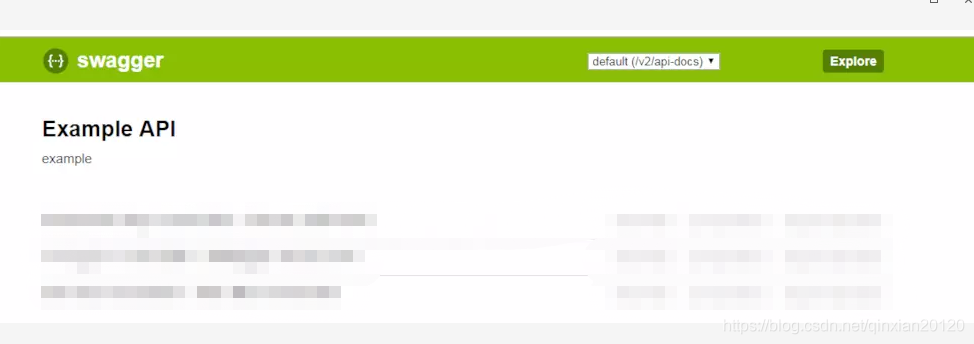
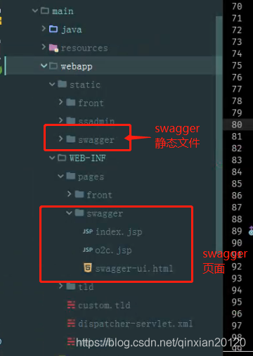
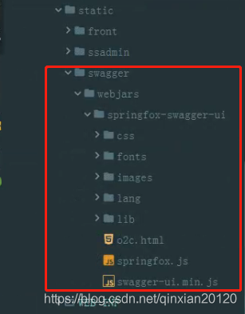
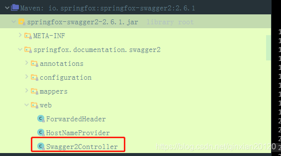
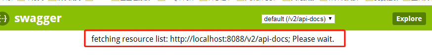

# 集成Swagger的问题（swagger-resourcesconfigurationui 404、弹窗等）解决 #

## 一、背景 ##

关于swagger的特性功能，用过的人都很清楚，确实也好用。可以参考http://springfox.github.io/springfox/docs/current/。另外关于swagger的使用集成，其实比较简单，网上博客也不少。尤其是SpringBoot出现后，集成更为简单方便。当然有时候也会遇到一些问题，以前集成过几次，都很顺手，但这次却遇到麻烦。

 

## 二、问题 ##

这次swagger的集成，是在原有项目的基础上进行的。开始是打开不了页面，后面能打开了却出不来接口的内容。换过swagger的版本，但仍然不行，网上的资料也看过，还是不能解决。尝试了几次之后，终于成功！

出现的问题主要有以下几种：

- swagger-ui.html页面打不开；
- swagger-ui.html页面打开后，接口的内容出不来；
- swagger-resources/configuration/ui报404错误；
- 换成高一点的版本后，打开swagger-ui.html页面时弹窗。

其中比较接近的一些是出现了下面的页面（下面的图经过处理了，有点模糊），只是接口的信息没有列出来。



 

## 三、问题的分析与解决 ##

**3.1 问题分析**

在分析问题时，肯定是要结合项目自身的情况。要清楚项目用了哪些框架，这些框架结合时，哪些地方可能会有影响等。也要清楚swagger本身的一些信息，知道它的结构目录。大概原理等。当然遇到简单的问题的话，可以不需要知道这些，但这次解决确实是分析了几方面的因素。

先介绍下项目本身的情况，项目是分布式的，已经上线运行了一些时间。使用的框架大概如下：

- Spring MVC；
- Shiro；
- 相关联的使用了Hibernate、Mybatis、Spring等等。

我需要集成swagger的项目，主要使用了Spring MVC和shiro，其它的没有影响。Spring MVC都熟悉，shiro是安全方面的框架。清楚这些情况后，开始分析出现问题的可能原因：

- web.xml配置的原因，拦截了swagger-ui.html及相关请求；
- Spring MVC配置文件的原因，比如没有扫描到相应的Controller；
- shiro的原因，因为shiro也拦截一些没有验证或没有放开（放开就是可以直接访问的如js文件）的请求；
- 项目使用了过滤器的原因，也将请求拦截了；
- 其它原因。

经过一定程序的熟悉了解，清楚了项目确实有滤器，会将所以请求先进行拦截。而我们在集成swagger后访问的地址是http://ip:port/projectName/swagger-ui.html。如果在web.xml中配置的请求是*.json，那这个请求就进不去，也就访问不了了。当时的配置如下所示（自然是访问不了的）：

```
<servlet-mapping>
    <servlet-name>dispatcher</servlet-name>
    <url-pattern>*.json</url-pattern>
</servlet-mapping>
```

请求进入过滤器后，对很多请求进行拦截验证，所以这样一来，就算我让swager-ui.html请求通过，但请求swagger-ui.html后swagger的其它请求依然不通过，因为简单的让使用swagger时出现的请求通过，不能从根本上解决问题。

对使用swagger时，一些请求及静态文件也会被shiro拦截，所以也需要修改shiro的配置。

对swagger，要确保它本身请求对应的swagger中的控制器能被扫描到。同时也要在项目中开启swagger的使用。下面开始找到解决方案，最后解决问题。

 

**3.2 解决方案**

根本上面的分析，因为尝试过多种方案，所以决定改造swagger-ui，将它本地化。基本做法就是将swagger-ui项目的内容复制到要集成的项目，然后写Controller以引导swagger-ui.html的访问，再修改配置文件，最后测试，大概是这样一个流程。

下面是当时集成时使用的swagger依赖，版本号是2.6.1。

```
<dependency>
    <groupId>io.springfox</groupId>
    <artifactId>springfox-swagger2</artifactId>
    <version>${swagger2.version}</version>
</dependency>
```

**3.3 问题解决**

**3.3.3 修改前端（js、页面）**

实现swagger-ui本地化时，是在项目中，直接将swagger-ui的文件复制过来。具体的目录结构如下图所示：



其中，webapp/static/swagger目录下的文件具体目录如下：



其实static/swagger中的文件是从swagger-ui里复制过来的，没有做过任何修改。但在/WEB-INF/pages/swagger目录下的页面，swagger-ui.html和o2c.jsp没用上，只有index.jsp用上了，它也复制的swagger-ui.html的内容，然后引入了两个js，实现了中文版的界面。index.jsp的具体代码如下：

```
<%@ taglib prefix="c" uri="http://java.sun.com/jsp/jstl/core" %>
<%@ page language="java" pageEncoding="UTF-8"%>
<c:set var="ctx" value="${pageContext.request.contextPath}" />
 
<!DOCTYPE html>
<html>
    <head>
        <meta charset="UTF-8">
        <title>Swagger UI</title>
        <link rel="icon" type="image/png" href="webjars/springfox-swagger-ui/images/favicon-32x32.png" sizes="32x32"/>
        <link rel="icon" type="image/png" href="webjars/springfox-swagger-ui/images/favicon-16x16.png" sizes="16x16"/>
        <link href='${ctx}/static/swagger/webjars/springfox-swagger-ui/css/typography.css' media='screen' rel='stylesheet' type='text/css'/>
        <link href='${ctx}/static/swagger/webjars/springfox-swagger-ui/css/reset.css' media='screen' rel='stylesheet' type='text/css'/>
        <link href='${ctx}/static/swagger/webjars/springfox-swagger-ui/css/screen.css' media='screen' rel='stylesheet' type='text/css'/>
        <link href='${ctx}/static/swagger/webjars/springfox-swagger-ui/css/reset.css' media='print' rel='stylesheet' type='text/css'/>
        <link href='${ctx}/static/swagger/webjars/springfox-swagger-ui/css/print.css' media='print' rel='stylesheet' type='text/css'/>
 
        <script src='${ctx}/static/swagger/webjars/springfox-swagger-ui/lib/object-assign-pollyfill.js' type='text/javascript'></script>
        <script src='${ctx}/static/swagger/webjars/springfox-swagger-ui/lib/jquery-1.8.0.min.js' type='text/javascript'></script>
        <script src='${ctx}/static/swagger/webjars/springfox-swagger-ui/lib/jquery.slideto.min.js' type='text/javascript'></script>
        <script src='${ctx}/static/swagger/webjars/springfox-swagger-ui/lib/jquery.wiggle.min.js' type='text/javascript'></script>
        <script src='${ctx}/static/swagger/webjars/springfox-swagger-ui/lib/jquery.ba-bbq.min.js' type='text/javascript'></script>
        <script src='${ctx}/static/swagger/webjars/springfox-swagger-ui/lib/handlebars-4.0.5.js' type='text/javascript'></script>
        <script src='${ctx}/static/swagger/webjars/springfox-swagger-ui/lib/lodash.min.js' type='text/javascript'></script>
        <script src='${ctx}/static/swagger/webjars/springfox-swagger-ui/lib/backbone-min.js' type='text/javascript'></script>
        <script src='${ctx}/static/swagger/webjars/springfox-swagger-ui/swagger-ui.min.js' type='text/javascript'></script>
        <script src='${ctx}/static/swagger/webjars/springfox-swagger-ui/lib/highlight.9.1.0.pack.js' type='text/javascript'></script>
        <script src='${ctx}/static/swagger/webjars/springfox-swagger-ui/lib/highlight.9.1.0.pack_extended.js' type='text/javascript'></script>
        <script src='${ctx}/static/swagger/webjars/springfox-swagger-ui/lib/jsoneditor.min.js' type='text/javascript'></script>
        <script src='${ctx}/static/swagger/webjars/springfox-swagger-ui/lib/marked.js' type='text/javascript'></script>
        <script src='${ctx}/static/swagger/webjars/springfox-swagger-ui/lib/swagger-oauth.js' type='text/javascript'></script>
 
        <script src='${ctx}/static/swagger/webjars/springfox-swagger-ui/springfox.js' type='text/javascript'></script>
        <!-- 加入下面的两个js后,访问swagger时语言会切换到中文 -->
        <script src='${ctx}/static/swagger/webjars/springfox-swagger-ui/lang/translator.js' type="text/javascript"></script>
        <script src='${ctx}/static/swagger/webjars/springfox-swagger-ui/lang/zh-cn.js' type="text/javascript"></script>
    </head>
 
    <body class="swagger-section">
        <div id='header'>
            <div class="swagger-ui-wrap">
                <a id="logo" href="http://swagger.io">
                    
                    <span class="logo__title">swagger</span>
                </a>
                <form id='api_selector'>
                    <div class='input'>
                        <select id="select_baseUrl" name="select_baseUrl"/>
                    </div>
                    <div class='input'><input placeholder="http://example.com/api" id="input_baseUrl" name="baseUrl" type="text"/></div>
                    <div id='auth_container'></div>
                    <div class='input'><a id="explore" class="header__btn" href="#" data-sw-translate>Explore</a></div>
                </form>
            </div>
        </div>
 
        <div id="message-bar" class="swagger-ui-wrap" data-sw-translate>&nbsp;</div>
        <div id="swagger-ui-container" class="swagger-ui-wrap"></div>
    </body>
</html>
```

**3.3.2 添加Swagger-ui请求的引导类及配置**

在输入http://localhost:8088/swagger-ui.html时，需要引入此请求进入到/pages/swagger/index.jsp，所以需要写一个Controller来引导此请求的访问。代码如下：

```
@Controller
@RequestMapping
@Slf4j
public class SwaggerController {
 
    /**
     * @Description 进入Swagger-ui.html页面
     * @Author Ethan
     * @Param []
     * @return org.springframework.web.servlet.ModelAndView
     * @Version 1.0
     */
    @RequestMapping("/swagger-ui")
    public ModelAndView index() {
        ModelAndView mv = new ModelAndView();
        mv.setViewName("swagger/index");
        return mv;
    }
 
 
//    @RequestMapping(value = "/webjars/springfox-swagger-ui/o2c", method = RequestMethod.GET)
//    public ModelAndView o2c() {
//        ModelAndView mv = new ModelAndView();
//        mv.setViewName("swagger/o2c");
//        return mv;
//    }
 
}
```

然后写swagger的配置类，代码如下：

```
@Configuration
@EnableWebMvc
@EnableSwagger2
@ComponentScan(basePackages = {"com.corn.web.controller"})
public class SwaggerConfig {
}
```

3.3.1 关于配置文件：修改web.xml和Spring MVC的配置文件。

修改web.xml文件，如下：

```
<!-- 使用swagger时，注释下面的filter,不然swagger的请求会被拦截而不能通过 -->
<!-- <filter>
    <filter-name>URL-REDIRECT-FILTER</filter-name>
    <filter-class>com.corn.web.filters.UrlAuthAndEncryFilter</filter-class>
</filter>
<filter-mapping>
    <filter-name>URL-REDIRECT-FILTER</filter-name>
    <url-pattern>/*</url-pattern>
</filter-mapping> -->
 
 
<servlet-mapping>
    <servlet-name>dispatcher</servlet-name>
    <!-- 启用swagger时，用此配置，因为接口的后缀是.json，而swagger请求的后缀不一样，直接用/ -->
    <!--<url-pattern>/</url-pattern>-->
    <!-- 线上环境时，不启用swagger，用下面的配置 -->
    <url-pattern>*.json</url-pattern>
</servlet-mapping>
```

修改Spring MVC的配置文件，需要加入swagger中controller所在包的路径扫描这一配置，如下：

```
<!-- 在启用swagger时，因为需要请求swagger的Controller，所以需要把swagger请求的Controller对应的上层路径springfox.documentation.swagger2加入扫描中 -->
	<context:component-scan base-package="springfox.documentation.swagger2" />
```

另外，需要注意的是，最初我写的扫描路径是springfox.documentation.swagger2.web，但发现报错了。后面改成springfox.documentation.swagger2就可以了。

下面的截图是swagger依赖的目录结构图，swagger的页面或其它请求，基本上请求的是Swagger2Controller，从图中可以看出此类所在的位置。



     

**3.3.4 本地测试**

上面的工作完成后，启动项目，在浏览器中输入地址：http://localhost:8088/swagger-ui.html，打开访问正常了，说明swagger-ui的本地化成功了。

需要注意的一点是，访问swagger时输入的地址一定要有sagger-ui.html，不然打开页面是空白的，即那些接口是显示不出来的。另外，有可能打开swagger-ui.html时，会显示如下内容，但过可能几秒钟，接口内容就出来了。



————————————————

版权声明：本文为CSDN博主「Ethan-cw」的原创文章，遵循CC 4.0 BY-SA

版权协议，转载请附上原文出处链接及本声明。

原文链接：https://blog.csdn.net/qinxian20120/article/details/89384049